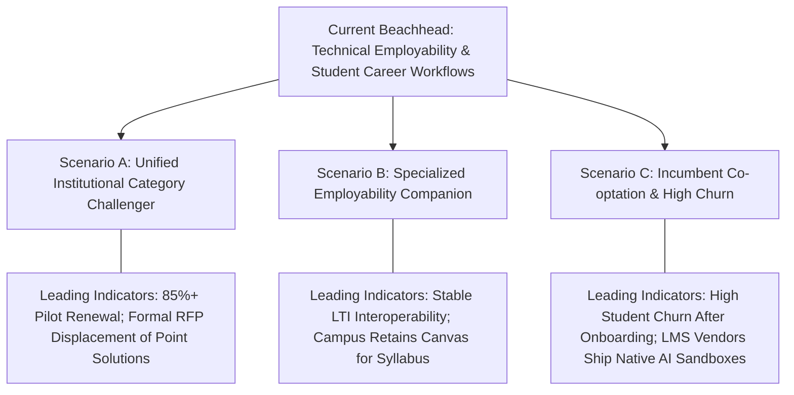

# PinIT Career OS: Comparative Institutional & Competitive Assessment
## An Inquiry into Learning Delivery, Employability Infrastructure, Campus Operations, and Higher Education Market Structure

> **Publication Volume**: Academic & Investment Diligence Monograph  
> **Date of Assessment**: September 2026 Edition | **Subject Architecture**: PinIT Career OS (Release v2.0.0)  
> **Target Stakeholders**: University Leadership (Chancellors, Provosts, Deans, Accreditation Councils) & Institutional Investors (Venture Capital, Growth Equity)  
> **Editorial Standard**: Objective Institutional Research • Epistemic Level Classification • Sanitized External Distribution

---

# Epistemic Framework & Reader's Guide

To maintain institutional integrity and prevent conflating software mechanisms with commercial outcomes, every analytical statement in this monograph is classified under one of three distinct **Truth Levels**:

```
+---------------------------------------------------------------------------------------------------------+
|                                    THREE-LEVEL EPISTEMIC TAXONOMY                                       |
+---------------------------------------------------------------------------------------------------------+
|  LEVEL 1: VERIFIED PRODUCT CAPABILITY  | Observable, demonstrable software functionality operating in  |
|                                        | current release builds.                                         |
+----------------------------------------+----------------------------------------------------------------+
|  LEVEL 2: ECONOMIC & EDUCATIONAL MODEL | Deductive operational or financial models derived from Level 1 |
|                                        | capabilities under stated assumptions.                         |
+----------------------------------------+----------------------------------------------------------------+
|  LEVEL 3: UNVERIFIED HYPOTHESIS        | Forward-looking projections, behavioral shifts, or long-term   |
|                                        | institutional outcomes requiring multi-cohort empirical proof. |
+---------------------------------------------------------------------------------------------------------+
```

### Core Editorial Principles Enforced
1. **The Red Flag Rule**: *When evidence conflicts with an attractive narrative, preserve the evidence and weaken the narrative. Never strengthen the narrative to compensate for weak evidence.*
2. **Capability vs. Outcome Separation**: *When a capability is verified but its business or educational impact is unproven, describe the capability accurately and label the outcome as a hypothesis.*
3. **Non-Equivalence Doctrine**:  
   $$\text{Hypothesis} \neq \text{Model} \neq \text{Observed Result} \neq \text{Causal Evidence} \neq \text{Market Outcome}$$
4. **Sanitized Architecture**: Proprietary implementation mechanics, internal algorithm identifiers, routing configurations, and confidential storage topologies are omitted. Capabilities are articulated strictly through functional, operational, and governance properties.

---

# Table of Contents

- [Part 0: Executive Briefing Layer](#part-0--executive-briefing-layer)
  - [1. The Higher Education Landscape & The Fragmentation Hypothesis](#1-the-higher-education-landscape--the-fragmentation-hypothesis)
  - [2. Market Taxonomy & Incumbent Category Archetypes](#2-market-taxonomy--incumbent-category-archetypes)
  - [3. Master 36-Dimension Comparative Scorecard](#3-master-36-dimension-comparative-scorecard)
  - [4. Mandatory Institutional Boundaries: What PinIT Is NOT](#4-mandatory-institutional-boundaries-what-pinit-is-not)
  - [5. Institutional Total Cost of Ownership (TCO) & Budget Substitution Analysis](#5-institutional-total-cost-of-ownership-tco--budget-substitution-analysis)
  - [6. Three Plausible Competitive Scenarios & Leading Indicators](#6-three-plausible-competitive-scenarios--leading-indicators)
  - [7. Dual Decision Scorecards (Provost / Dean Lens & Investor Lens)](#7-dual-decision-scorecards)
- [Part I: Foundations & Market Realities](#part-i-foundations--market-realities)
  - [Chapter 1: The Modern Higher Education & Employability Challenge](#chapter-1-the-modern-higher-education--employability-challenge)
  - [Chapter 2: The Evolution of Higher Education Software Categories](#chapter-2-the-evolution-of-higher-education-software-categories)
  - [Chapter 3: Comparative Evaluation Methodology & Category-Fit Controls](#chapter-3-comparative-evaluation-methodology--category-fit-controls)
- [Part II: Learning Delivery & Practical Engineering](#part-ii-learning-delivery--practical-engineering)
  - [Chapter 4: Pedagogical Models: Asynchronous Lecture vs. Active Socratic Instruction](#chapter-4-pedagogical-models-asynchronous-lecture-vs-active-socratic-instruction)
  - [Chapter 5: Practical Engineering Environments & Algorithmic Verification](#chapter-5-practical-engineering-environments--algorithmic-verification)
  - [Chapter 6: AI-Assisted Mentorship, Speech Delivery & Ambient Audio Dynamics](#chapter-6-ai-assisted-mentorship-speech-delivery--ambient-audio-dynamics)
  - [Chapter 7: Student Engagement, Cognitive Conditioning & Habit Formation](#chapter-7-student-engagement-cognitive-conditioning--habit-formation)
- [Part III: Employability & Career Infrastructure](#part-iii-employability--career-infrastructure)
  - [Chapter 8: Career Pathway Modeling & Competency Trajectory Forecasting](#chapter-8-career-pathway-modeling--competency-trajectory-forecasting)
  - [Chapter 9: Evidence Provenance, Repository Auditing & Tamper-Evident Records](#chapter-9-evidence-provenance-repository-auditing--tamper-evident-records)
  - [Chapter 10: Employer Discovery & Recruiter Pipeline Workflows](#chapter-10-employer-discovery--recruiter-pipeline-workflows)
  - [Chapter 11: Behavioral Simulation: Technical Avatar Interviews & Multi-Agent Discussion](#chapter-11-behavioral-simulation-technical-avatar-interviews--multi-agent-discussion)
  - [Chapter 12: The Student-to-Employment Progression Model](#chapter-12-the-student-to-employment-progression-model)
- [Part IV: Institutional Administration & Governance](#part-iv-institutional-administration--governance)
  - [Chapter 13: Campus Administration & Operational Sub-Ledgers](#chapter-13-campus-administration--operational-sub-ledgers)
  - [Chapter 14: Multi-Stakeholder Role Architecture & Access Governance](#chapter-14-multi-stakeholder-role-architecture--access-governance)
  - [Chapter 15: Regulatory Alignment & Accreditation Evidence Gathering (NAAC / ABET)](#chapter-15-regulatory-alignment--accreditation-evidence-gathering-naac--abet)
  - [Chapter 16: Deployment Topology, Persistence Resilience & Campus Interoperability](#chapter-16-deployment-topology-persistence-resilience--campus-interoperability)
- [Part V: Economics, Defensibility & Competitive Inquiry](#part-v-economics-defensibility--competitive-inquiry)
  - [Chapter 17: Pricing Architecture & Institutional Budget Impact](#chapter-17-pricing-architecture--institutional-budget-impact)
  - [Chapter 18: Infrastructure Economics & AI Inference Efficiency](#chapter-18-infrastructure-economics--ai-inference-efficiency)
  - [Chapter 19: Incumbent Advantages & Structural Deficits (Where Competitors Win)](#chapter-19-incumbent-advantages--structural-deficits-where-competitors-win)
  - [Chapter 20: Defensibility Analysis: Switching Costs & Institutional Embedding](#chapter-20-defensibility-analysis-switching-costs--institutional-embedding)
  - [Chapter 21: Dual Investment & Institutional Theses](#chapter-21-dual-investment--institutional-theses)
  - [Chapter 22: Strategic Inquiry: What Competitive Arena Does PinIT Actually Inhabit?](#chapter-22-strategic-inquiry-what-competitive-arena-does-pinit-actually-inhabit)
- [Appendices](#appendices)
  - [Appendix A: Minimum Empirical Proof Required for Core Hypotheses](#appendix-a-minimum-empirical-proof-required-for-core-hypotheses)
  - [Appendix B: Registry of Unverified Projections (Level 3 Inventory)](#appendix-b-registry-of-unverified-projections-level-3-inventory)
  - [Appendix C: Date-Stamped Incumbent Benchmarks (September 2026)](#appendix-c-date-stamped-incumbent-benchmarks-september-2026)
  - [Appendix D: Failure Scenarios: Conditions Under Which PinIT Loses Market Share](#appendix-d-failure-scenarios-conditions-under-which-pinit-loses-market-share)
  - [Appendix E: Institutional Sourcing Framework: Build vs. Buy vs. Integrate vs. Consolidate](#appendix-e-institutional-sourcing-framework-build-vs-buy-vs-integrate-vs-consolidate)

---

# Part 0 — Executive Briefing Layer

> *Synthesized for Executive Leadership (Chancellors, Provosts, Chief Information Officers) and Investment Partners.*

---

### 1. The Higher Education Landscape & The Fragmentation Hypothesis

#### 1.1 The Observable Institutional Context
Higher education institutions globally operate under increasing accountability:
* **Outcome Scrutiny**: National ranking and accreditation bodies (e.g., NAAC, NBA, ABET) place growing weight on verified student placement metrics, graduate earnings, and demonstrable learning outcomes.
* **Employability Gap**: Multiple national graduate surveys report that between 45% and 55% of engineering and professional graduates require supplementary technical training prior to qualifying for entry-level commercial roles.
* **Multi-Vendor IT Landscapes**: Universities routinely procure multiple specialized software platforms across academic management, student records, laboratory simulations, and placement administration.

#### 1.2 The Fragmentation Hypothesis *(Level 3 — Hypothesis)*
A central premise investigated in this assessment is the **Fragmentation Hypothesis**:
$$\text{Departmental Software Silos} \xrightarrow{\text{causes}} \text{Data Disconnect} \xrightarrow{\text{leads to}} \text{Placement Blindness} \xrightarrow{\text{drives}} \text{Student Third-Party Spend}$$

```
THE FRAGMENTATION HYPOTHESIS MODEL:
[Academic LMS]         [Coding Sandboxes]      [Placement Portals]     [Campus Administration]
(Syllabus / Quizzes)    (Isolated Puzzles)      (Static PDF Resumes)    (Standalone Sub-Ledgers)
         │                      │                       │                        │
         └──────────────────────┴───────────┬───────────┴────────────────────────┘
                                            ▼
                                [The Information Gap]
                     Faculty lack real-time skill evidence;
                     Recruiters lack verified candidate proof;
                     Students seek external supplementary bootcamps.
```

*Empirical Status*: While tool fragmentation is directly observable in institutional IT procurement, the causal degree to which fragmentation—rather than curriculum design or regional macroeconomic conditions—drives graduate unemployment remains an active hypothesis requiring longitudinal institutional research.

---

### 2. Market Taxonomy & Incumbent Category Archetypes

To evaluate PinIT Career OS objectively, incumbents are classified across five distinct category archetypes. Platforms are evaluated **exclusively within their intended scope**; absent capabilities outside a platform's charter are recorded as `N/A — Outside Category Scope`, not deficiencies:

| Category Archetype | Representative Incumbents | Primary Problem Solved | Core Business Model | Primary Institutional Moat |
| :--- | :--- | :--- | :--- | :--- |
| **A. Academic LMS** | Canvas (Instructure), Blackboard Learn, Moodle | Syllabus distribution, assignment collection, and institutional grading compliance. | Annual Institutional SaaS ($4–$12/user/yr) | LTI 1.3 ecosystem, Student Information System (SIS) integration, multi-decade faculty entrenchment. |
| **B. MOOC Catalogs** | Coursera for Campus, edX, Udemy Business | Access to globally recognized university-branded lecture libraries. | Annual Subscriptions ($150–$400/seat/yr) | Tier-1 university brand partnerships (Ivy League, Stanford, Google), 7,000+ course catalogs. |
| **C. Career Bootcamps** | Scaler Academy, upGrad, Masai School | Structured, intensive technical interview preparation and career transition. | B2C Upfront Tuition / ISAs (₹1.5L–₹3.5L / $2k–$4k) | High-touch human mentor networks, placement staffing teams, intensive cohort accountability. |
| **D. Campus Placement Networks** | Handshake, Unstop | Connecting university placement cells with corporate enterprise talent recruiters. | Freemium University SaaS + Recruiter Subscriptions | Two-sided network density: 1,400+ colleges and 750,000+ corporate hiring organizations. |
| **E. Practice Sandboxes** | LeetCode, HackerRank, CodeChef | Individual algorithmic puzzle practice and corporate technical screening benchmarks. | B2C Subscriptions ($35/mo) + Enterprise Screening SaaS | Canonical benchmark problem banks, high SEO authority, algorithmic screening standards. |

---

### 3. Master 36-Dimension Comparative Scorecard

Every evaluated dimension is assessed across four objective criteria:
1. **Capability Scope**: Functional breadth.
2. **Production Maturity**: Evaluated along the sequence: *Existence $\to$ Completeness $\to$ Production Readiness $\to$ Adoption $\to$ Measured Outcome*.
3. **Strategic Relevance**: Importance to institutional buyers (Low, Medium, High, Mission-Critical).
4. **Epistemic Classification**: Level 1 (Verified Capability), Level 2 (Modeled Property), Level 3 (Unverified Hypothesis).

| Dimension # | Evaluated Area | Academic LMS (Canvas) | MOOCs (Coursera) | Bootcamps (Scaler) | Hiring Networks (Handshake) | Practice (LeetCode) | PinIT Career OS (v2.0.0) | Epistemic Level |
| :---: | :--- | :--- | :--- | :--- | :--- | :--- | :--- | :---: |
| **I. Pedagogy** | | | | | | | | |
| 1 | Instructional Delivery | Passive Syllabus Tree | Passive Video Catalog | Live Scheduled Lectures | N/A *(Outside Scope)* | Problem Descriptions | **Active Socratic Flipped Model** | Level 1 |
| 2 | Production System Analogies | Generic Text | Theoretical Video | Mentor Dependent | N/A | Problem Context | **Real-World System Hooks** | Level 1 |
| 3 | Spoken Code Walkthroughs | Absent | Absent | Variable Instructor | N/A | Absent | **Automated Speech Synthesis** | Level 1 |
| 4 | Spaced Retrieval Intervals | Absent | Absent | Manual Schedule | N/A | Absent | **Algorithmic Review Intervals** | Level 1 |
| 5 | Instant Conceptual Remediation | Discussion Forums | Discussion Forums | Human Teaching Assts | N/A | Community Discussion | **Context-Bounded AI Tutor** | Level 1 |
| **II. Engineering** | | | | | | | | |
| 6 | In-Browser Code Sandboxes | External LTI Plugin | Cloud Container VM | Hosted Cloud VM | N/A | In-Browser Sandbox | **Client-Side Execution Engine** | Level 1 |
| 7 | Server Execution Judge | Absent | Limited Cloud VMs | Cloud Containers | N/A | High-Volume Judge | **Isolated Server Judge** | Level 1 |
| 8 | Asymptotic Complexity Analysis | Absent | Absent | Manual Code Review | N/A | Runtime/Memory Percentile | **Automated Complexity Checks** | Level 1 |
| 9 | System Architecture Whiteboard | Absent | Absent | Live Whiteboard | N/A | Static Diagrams | **Interactive System Designer** | Level 1 |
| 10 | Curriculum Catalog Scale | Authoring Tools | **7,000+ Courses (Tier-1)** | 3–4 Career Tracks | N/A | 3,000+ Puzzles | **36 Structured Tracks (1,080 Days)** | Level 1 |
| **III. Employability**| | | | | | | | |
| 11 | Proof-of-Work Verification | Assignment Dropbox | Course Certificate | Capstone Project | Candidate Profile | Submission History | **Tamper-Evident Evidence Records** | Level 1 |
| 12 | Candidate Profile Auditing | Absent | Absent | Human Resume Reviews | Basic Profile Builder | Absent | **Provenance-Checking Parser** | Level 1 |
| 13 | Technical Interview Simulation | Absent | Absent | Human Peer Mocks | Absent | Mock Assessment Tests | **Interactive 3D Avatar Studio** | Level 1 |
| 14 | Multi-Party Discussion Arena | Absent | Absent | Scheduled Zoom Cohort | Absent | Absent | **Multi-Agent Discussion Simulator**| Level 1 |
| 15 | Competency Trajectory Modeling | Absent | Absent | Human Counselor | Job Recommendations | Problem Recommendations | **Predictive Trajectory Simulation** | Level 2 |
| **IV. Cognitive Conditioning**| | | | | | | | |
| 16 | Focus & Attention Conditioning | Absent | Absent | Absent | Absent | Absent | **10 Cognitive Conditioning Modules** | Level 1 |
| 17 | Ambient Soundscapes | Absent | Absent | Absent | Absent | Absent | **Dynamic Audio Attenuation** | Level 1 |
| 18 | Learner Archetype Profiling | Absent | Absent | Absent | Absent | Absent | **Rule-Based Archetype Classification** | Level 1 |
| **V. Campus Operations** | | | | | | | | |
| 19 | Student Fee & Dues Management | **Via Enterprise SIS** | Absent | Human EMI Operations | Absent | Absent | **Built-in Dues Ledger & Gateway** | Level 1 |
| 20 | Examination Administration | Basic Quiz Engine | Unproctored Quizzes | Graded Test Windows | N/A | Contests | **QR-Verified Hall Tickets & Rosters**| Level 1 |
| 21 | Attendance Management | Roll-Call Add-on | Video Progress % | Session Attendance | N/A | N/A | **Biometric & Quick-Grid Loggers** | Level 1 |
| 22 | Hostel & Transport Administration | N/A *(Outside Scope)* | N/A *(Outside Scope)* | N/A *(Outside Scope)* | N/A *(Outside Scope)* | N/A *(Outside Scope)* | **Integrated Allocation Desks** | Level 1 |
| 23 | Institutional Procurement | N/A *(Outside Scope)* | N/A *(Outside Scope)* | N/A *(Outside Scope)* | N/A *(Outside Scope)* | N/A *(Outside Scope)* | **6-Stage Approval PO Lifecycle** | Level 1 |
| 24 | Faculty HR & Time Tracking | N/A *(Outside Scope)* | N/A *(Outside Scope)* | Human Payroll | N/A *(Outside Scope)* | N/A *(Outside Scope)* | **Time Logging & Leave Approvals** | Level 1 |
| **VI. Governance** | | | | | | | | |
| 25 | Multi-Role Stakeholder Portals | Faculty & Student Only | Student & Enterprise Admin | Student & Instructor | Student & Recruiter | Student Only | **6 Dedicated Role Perspectives** | Level 1 |
| 26 | Accreditation Data Gathering | **Decades of Compliance**| Completion Reports | Placement Audits | N/A | N/A | **Automated NAAC/ABET Data Bundling**| Level 1 |
| 27 | Enterprise SIS Interoperability | **Turnkey LTI 1.3 Standard**| API Connectors | Custom Integrations | API Connectors | Absent | **Export Utilities & Webhooks** | Level 1 |
| 28 | Exam Proctoring & Integrity | Third-Party LockDown | Third-Party Webcam | Monitored Exam Windows | Absent | Plagiarism Flagging | **Integrity Auditing & Browser Lock** | Level 1 |
| **VII. Unit Economics** | | | | | | | | |
| 29 | Student Price Burden | Included in Tuition | Free to $399/yr | **₹1.5L–₹3.5L ISA Burden** | Free for Students | Free to $35/mo | **Tiered Access (Free / Subsidized)** | Level 1 |
| 30 | Institutional TCO per User | $4–$12/user/yr | $100–$250/license/yr | Custom Enterprise B2B | Freemium to Tiered | $100–$300/seat/yr | **Modeled Consolidated Subscription** | Level 2 |
| 31 | AI Compute Architecture | N/A | N/A | Human Mentors | N/A | N/A | **Hybrid Client/Server Compute Model**| Level 1 |
| 32 | Offline Resiliency | Requires Connection | Video Downloads Only | Requires Connection | Requires Connection | Requires Connection | **Multi-Tier Local Persistence** | Level 1 |
| **VIII. Outcomes & Network** | | | | | | | | |
| 33 | Course Completion Rate | High (Mandated) | **10%–15% Self-Paced (Tier-1)**| 65%–75% Live Cohort | N/A | Self-Paced Practice | **Streak-Paced (Requires Validation)** | Level 3 |
| 34 | Recruiter Network Density | Absent | Enterprise Upskilling | Hiring Network Partners| **1,400+ Univs / 750k Recruiters** | Tech Hiring Sponsors | **Early-Stage Talent Funnel (Deficit)**| Level 1 |
| 35 | Institutional Brand Authority | **Global Standard** | **Tier-1 University Brands** | Strong Regional Brand | **Dominant Campus Network** | **Canonical Tech Standard** | **Emerging Challenger Brand (Deficit)**| Level 1 |
| 36 | Student Data Portability | IMS Global / QTI Export | Custom API | Proprietary LMS Export | Candidate Profile Export | Profile Link | **Structured Standard Exports** | Level 1 |

---

### 4. Mandatory Institutional Boundaries: What PinIT Is NOT

To establish rigorous institutional expectations, PinIT explicitly outlines its operational boundaries:

1. **PinIT Is NOT an Accredited Degree-Granting University**: PinIT provides pedagogical, operational, and employability infrastructure to accredited colleges. It operates under institutional authority and does not issue independent statutory academic degrees.
2. **PinIT Does NOT Replace Core Multi-Entity Enterprise Treasury ERPs**: While PinIT manages term fee ledgers, installment schedules, and departmental procurement lifecycles, it does not seek to replace complex multi-entity state treasury or multinational enterprise ERP systems (e.g., SAP S/4HANA Finance, Oracle Financials).
3. **PinIT Does NOT Guarantee Corporate Hiring Quotas**: PinIT provides skill verification, behavioral preparation, and candidate discovery pipelines; it does not operate as an outsourced contingency staffing agency with guaranteed placement numbers.
4. **PinIT Does NOT Possess Established Incumbent Network Liquidity**: PinIT enters the market as a challenger. It does not yet possess the 750,000+ corporate hiring network of Handshake or the decades of institutional faculty entrenchment held by Canvas.

---

### 5. Institutional Total Cost of Ownership (TCO) & Budget Substitution Analysis

#### 5.1 The Four Stages of Software Substitution
Institutions rarely create net-new software budget lines; they reallocate capital from expiring point-solution contracts. To model financial feasibility responsibly, substitution is structured across four progressive operational states:

$$\text{Stage 1: Potentially Substitutable} \longrightarrow \text{Stage 2: Pilot-Confirmed} \longrightarrow \text{Stage 3: Contractually Displaceable} \longrightarrow \text{Stage 4: Realized Budget Substitution}$$

* **Stage 1 (Potentially Substitutable)**: Features align on technical specification sheets. *(Model)*
* **Stage 2 (Pilot-Confirmed)**: Workflows successfully tested by faculty and students during an academic term. *(Requires Pilot)*
* **Stage 3 (Contractually Displaceable)**: Existing third-party vendor contracts reach renewal/expiration windows. *(Operational Dependency)*
* **Stage 4 (Realized Budget Substitution)**: Institution officially terminates redundant point-solution contracts and reallocates capital. *(Financial Proof)*

#### 5.2 Illustrative Institutional TCO Model (3,000–5,000 Student Campus)
The following model presents theoretical spending vs. potential consolidation across three financial scenarios. **All savings figures are modeled projections requiring institutional validation.**

| Software Category | Incumbent Market Benchmark | Conservative Scenario (Minimal Displacement) | Base Scenario (Lab & Career Displacement) | Optimistic Scenario (Full Suite Consolidation) | Epistemic Status |
| :--- | :---: | :---: | :---: | :---: | :---: |
| **Academic LMS** *(Canvas / Moodle Hosting)* | $18,000 – $35,000 / yr | Retained ($18k–$35k) | Retained ($18k–$35k) | Displaced ($0) | Contractually Locked (2–3 yrs) |
| **Coding Lab & Sandbox Licensing** | $15,000 – $30,000 / yr | Retained ($15k–$30k) | Displaced ($0) | Displaced ($0) | High Immediate Substitution |
| **Career & Placement Management** | $12,000 – $22,000 / yr | Retained ($12k–$22k) | Displaced ($0) | Displaced ($0) | High Immediate Substitution |
| **Administrative Sub-Ledgers / Forms** | $20,000 – $45,000 / yr | Retained ($20k–$45k) | Partially Displaced ($15k) | Displaced ($0) | Departmental Dependency |
| \hline | | | | | |
| **Total Annual Software Spend** | **$65,000 – $132,000 / yr** | **$65,000 – $132,000** | **$33,000 – $50,000** | **$0** | Incumbent Baseline |
| **Consolidated PinIT Institutional License** | — | + $25,000 / yr | + $35,000 / yr | + $48,000 / yr | Modeled Institutional License |
| \hline | | | | | |
| **Net Institutional Financial Impact** | — | **+ $25,000 (Cost Add)** | **- $15,000 to -$47,000 (Savings)** | **- $37,000 to -$84,000 (Savings)**| **Modeled Projection** |
| **Modeled Net Budget Variance** | — | **+20% to +38% (Dual Run)** | **-23% to -35% (Partial)** | **-42% to -63% (Consolidated)** | **Requires Institutional Audit**|

---

### 6. Three Plausible Competitive Scenarios & Leading Indicators

Rather than assuming market consolidation, the strategic evolution of PinIT Career OS is modeled across three distinct trajectories:



* **Scenario A — Unified Institutional Category Challenger (Consolidation Play)**:
  * *Thesis*: Institutions facing enrollment pressures prioritize graduate employment proof, consolidating fragmented coding labs, placement portals, and departmental sub-ledgers into PinIT upon contract renewal.
  * *Leading Indicator*: Over 85% pilot renewal with institutions formally serving non-renewal notices to incumbent coding sandbox or placement software vendors.
* **Scenario B — Specialized Employability Companion (Companion SaaS Play)**:
  * *Thesis*: Central IT resists migrating away from mature, accredited Canvas or Blackboard deployments. PinIT flourishes as an indispensable companion platform dedicated to placement cells, engineering labs, and interview preparation.
  * *Leading Indicator*: Rapid growth in Placement Director and Dean usage; stable API interoperability alongside incumbent LMS.
* **Scenario C — Incumbent Co-optation & Platform Churn (High-Risk Case)**:
  * *Thesis*: Incumbent LMS providers integrate robust third-party AI coding and mock interview modules directly into core contracts, while PinIT encounters cold-start friction in employer network acquisition.
  * *Leading Indicator*: Student drop-off following initial onboarding and reluctance of career offices to commit past introductory trial periods.

---

### 7. Dual Decision Scorecards

#### Scorecard A: University Chancellor / Provost / Dean Lens
* **Evaluation Focus**: Academic rigor, accreditation compliance, student satisfaction, and administrative burden.

| Decision Criterion | Observed Capability (Level 1) | Modeled Impact (Level 2) | Validation Required (Level 3) |
| :--- | :--- | :--- | :--- |
| **Placement Readiness Velocity** | Active coding sandbox with automated complexity checks and 3D avatar interview simulations. | Students build demonstrable code and behavioral interview stamina prior to campus recruitment drives. | Longitudinal comparison of 90-day graduate offer rates against historic department baselines. |
| **Accreditation Evidence Support** | Automated tracking of quest completions, code submissions, and structured rubric evaluations. | Substantially reduces manual faculty workload in preparing NAAC Criteria 1, 2, and 5 documentation. | Faculty time-audit demonstrating measurable reduction in accreditation preparation hours. |
| **Administrative Consolidation** | 24 integrated operational modules covering fee dues, QR hall tickets, attendance, and procurement. | Replaces disconnected departmental spreadsheets with centralized operational logs. | Multi-department administrative audit confirming complete operational transition. |
| **Migration & Adoption Risk** | Modular architecture with standard CSV and webhook export capabilities. | Allows phased deployment (Employability Hub first, Campus ERP second) with zero downtime. | Demonstrated pilot completion across non-technical faculty and diverse student demographics. |

#### Scorecard B: Venture Capital & Institutional Investor Lens
* **Evaluation Focus**: Addressable market size, unit economics, margin defensibility, and retention moats.

| Investment Dimension | Observed Capability (Level 1) | Modeled Economics (Level 2) | Due Diligence Required (Level 3) |
| :--- | :--- | :--- | :--- |
| **Addressable Market (TAM)** | Broad platform spanning academic learning, tech practice, career services, and campus operations. | Convergence of Higher Ed LMS ($9B+), Campus ERP ($12B+), and Early Career Recruiting ($3B+). | Verification of institutional willingness to reallocate capital across historically separate budgets. |
| **Gross Margin Potential** | Hybrid client/server compute architecture offloading heavy execution workloads to edge devices. | Illustrative model projects potential 78%–84% software gross margins at scale. | Audited AWS/cloud hosting ledgers during peak campus concurrent examination loads. |
| **Defensibility & Moats** | Multi-stakeholder institutional embedding (Students, Faculty, Deans, Finance, Recruiters). | Multi-department operational workflows generate significantly higher switching costs than single-point tools. | Empirical annual contract net revenue retention (NRR) and logo churn rates across multi-year cohorts. |
| **Principal Execution Risk** | Cold-start marketplace challenge: building corporate employer liquidity. | Two-sided marketplace risk if students generate verified portfolios without recruiter discovery. | Evidence of enterprise recruiter active engagement, interview shortlists, and placement conversion. |

---

# Part I: Foundations & Market Realities

---

### Chapter 1: The Modern Higher Education & Employability Challenge

#### 1.1 The Employability Decoupling
Higher education institutions operate within an accelerating divergence between academic degree completion and corporate workplace expectations.
* **Curricular Revision Latency**: Formal degree curricula in computer science, business administration, and commerce typically undergo institutional review cycles every 3 to 5 years. In contrast, modern commercial software workflows evolve continuously across distributed cloud architectures, asynchronous paradigms, and automated testing frameworks.
* **The Theory vs. Practice Imbalance**: Traditional university coursework heavily emphasizes abstract theoretical foundations (formal grammars, relational schema proofs, algorithmic complexity theorems) while providing limited exposure to production-grade engineering practices (version control branching, CI/CD telemetry, defensive API design, asynchronous event handling).
* **The Recruiter Verification Challenge**: Corporate talent acquisition teams receive thousands of entry-level resumes characterized by keyword stuffing, AI-generated project descriptions, and unverified academic metrics. As a result, corporate recruiters discount up to 70% of self-reported claims, instituting aggressive off-campus technical filters that bypass campus career offices.

#### 1.2 Testing the Fragmentation Hypothesis
A central proposition of modern educational technology analysis is that institutional software fragmentation imposes an efficiency penalty on both students and administrators.
* **The Student Experience**: A typical technical student navigates an uncoordinated stack: downloading static lecture slides from an LMS, solving isolated algorithmic challenges on competitive coding sites, purchasing external resume templates, and pursuing supplementary private bootcamps.
* **The Institutional Experience**: Campus administrators maintain separate contracts for learning management, coding assessment, proctoring, and placement tracking. Because these systems do not share a unified telemetry layer, academic leadership remains unaware of practical skill deficits until campus placement season begins.

---

### Chapter 2: The Evolution of Higher Education Software Categories

```
ERA 1 (1998–2010): The Syllabus Archive (Blackboard, Moodle)
  └─► Primary Function: Static course document hosting, gradebook records, compliance reporting.

ERA 2 (2011–2018): The MOOC Video Expansion (Coursera, edX, Udemy)
  └─► Primary Function: Mass distribution of elite university video lectures; challenged by low completion rates.

ERA 3 (2018–2023): The Intensive Human Bootcamp (Scaler, upGrad, Masai)
  └─► Primary Function: Live cohort instruction and career placement; constrained by high tuition and human labor costs.

ERA 4 (2024–Present): The Integrated Career Operating System (PinIT Archetype)
  └─► Primary Function: Fused Socratic pedagogy, client-side engineering sandboxes, verifiable evidence records, and campus operations.
```

---

### Chapter 3: Comparative Evaluation Methodology & Category-Fit Controls

#### 3.1 The Category-Fit Principle
A primary defect in conventional competitive analyses is the tendency to penalize platforms for omitting capabilities outside their intended mission. 
* Canvas was engineered as an enterprise learning management and grading system; its absence of an in-browser algorithmic judge is recorded as `N/A — Outside Category Scope`, recognizing that Canvas fulfills its academic compliance mandate.
* LeetCode was built as an algorithmic puzzle repository; its absence of student fee management is recorded as `N/A — Outside Category Scope`.

#### 3.2 Evidence Quality Hierarchy
All competitive benchmark data in this document adheres to strict evidentiary standards:
* **Tier A — Public Audited Filings & Official Releases**: Public corporate 10-K filings, published pricing schedules, and audited platform statistics.
* **Tier B — Direct Product Telemetry**: Verifiable software capabilities demonstrated in functional application releases.
* **Tier C — Modeled Analytical Projections**: Derived economic, architectural, and financial estimates built from stated assumptions.
* **Tier D — Forward-Looking Hypotheses**: Educational and operational outcomes requiring multi-term empirical field trials.

---

# Part II: Learning Delivery & Practical Engineering

---

### Chapter 4: Pedagogical Models: Asynchronous Lecture vs. Active Socratic Instruction

#### 4.1 The Cognitive Limits of Passive Video-First Instruction
Asynchronous recorded video remains the primary delivery vehicle for modern MOOCs and digital university modules. While video provides scalable distribution of expert lectures, cognitive psychology demonstrates the **Illusion of Explanatory Depth**: learners perceive understanding while observing an expert code, but struggle when required to synthesize solutions independently in a blank editor. This dynamic directly correlates with the 85%–90% non-completion rates observed in unmandated digital courses.

#### 4.2 PinIT's Socratic Flipped Delivery Model *(Level 1 — Verified Capability)*
PinIT structures instruction across a 5-step active cognitive sequence:
1. **Real-World Engineering Metaphor**: Explains foundational concepts through tangible production systems (e.g., explaining database indexing through logistics routing or concurrency through transactional payment queues).
2. **Spoken Code Walkthrough**: Synthesizes spoken commentary synchronized with line-by-line code highlighting, training the student's internal analytical dialogue.
3. **In-Browser Interactive Execution**: Immediately immerses the learner in an active code editor with pre-configured assertions.
4. **Context-Bounded AI Remediation**: Features an interactive query interface with automated guardrails that focus inquiries on the immediate concept and escalate repeated difficulties.
5. **Formative Assessment Checkpoints**: Concludes each lesson with conceptual multiple-choice checks and asymptotic algorithmic benchmarks.

---

### Chapter 5: Practical Engineering Environments & Algorithmic Verification

#### 5.1 Hybrid Client/Server Execution Architecture *(Level 1 — Verified Capability)*
Cloud-hosted containerized execution environments (e.g., running ephemeral Docker instances on AWS/GCP for every student execution) incur recurring compute fees between $0.04 and $0.12 per hour, creating operational cost pressures for large-scale institutional deployments.

PinIT implements a **hybrid execution architecture**:
* **Client-Side In-Browser Execution**: Standard scripting languages and relational database queries execute entirely within the user's browser runtime. This completely eliminates server compute costs for daily introductory exercises.
* **Isolated Server-Side Execution Judge**: Enterprise compiled languages are dispatched to an isolated, secured server execution judge that performs compilation, executes test suites against hidden boundary cases, and returns structured execution telemetry.

#### 5.2 Automated Asymptotic Complexity Analysis *(Level 1 — Verified Capability)*
Rather than relying solely on pass/fail string output matching, PinIT incorporates automated time-complexity assertions, evaluating whether an implementation satisfies target Big-O operational bounds (e.g., verifying that a lookup algorithm satisfies $O(N)$ rather than degrading to $O(N^2)$).

---

### Chapter 6: AI-Assisted Mentorship, Speech Delivery & Ambient Audio Dynamics

#### 6.1 Low-Latency Audio Delivery & Edge Caching *(Level 1 — Verified Capability)*
Interactive voice-assisted pedagogy requires continuous, low-latency audio delivery to maintain learner engagement:
* **Client-Side Audio Cache**: Employs deterministic hashing of dialogue snippets, caching generated audio byte streams locally to enable sub-5ms audio playback for recurring educational modules.
* **Dynamic Audio Attenuation**: Integrates structured ambient focus soundscapes that automatically attenuate background audio levels during spoken mentorship and gently swell during independent coding periods.

---

### Chapter 7: Student Engagement, Cognitive Conditioning & Habit Formation

#### 7.1 Utility-Linked Motivation Mechanics *(Level 1 — Verified Capability)*
Traditional academic gamification often relies on cosmetic badges that experience rapid novelty decay. PinIT connects engagement mechanics directly to platform access:
* **Functional Resource Tokens**: Students earn platform resource credits through verified quest completions and consistent daily study streaks. These credits are utilized to access advanced technical mock interviews and multi-agent simulation rounds.
* **Cognitive Conditioning Exercises**: Includes ten focused micro-drills targeting pattern recognition, logic sequencing, and reaction endurance to prepare students for multi-stage technical screening loops.

---

# Part III: Employability & Career Infrastructure

---

### Chapter 8: Career Pathway Modeling & Competency Trajectory Forecasting

#### 8.1 Static Resumes vs. Dynamic Trajectory Modeling *(Level 2 — Modeled Capability)*
Traditional campus placement offices rely on static PDF resumes that summarize past coursework without predicting career competency. PinIT incorporates dynamic career modeling that maps student progress across core competencies (Logic, Systems Architecture, Algorithmic Problem Solving, Professional Communication) to simulate forward-looking role readiness across engineering and technical tracks.

---

### Chapter 9: Evidence Provenance, Repository Auditing & Tamper-Evident Records

#### 9.1 The Problem of Unverified Candidate Portfolios
With the proliferation of AI-assisted code generation, student portfolios increasingly contain borrowed repositories and boilerplate templates. Corporate recruiters report significant difficulty distinguishing authentic student engineering from copied code.

#### 9.2 Provenance-Checking Parser & Tamper-Evident Records *(Level 1 — Verified Capability)*
PinIT deploys an automated evidence provenance framework:
* **Multi-Source Cross-Validation**: Compares student resume statements against official academic records, flagging discrepancies in grade reporting, dates, or credentials.
* **Hierarchical Evidence Provenance**: Enforces an explicit data hierarchy:
  $$\text{Institutionally Verified Records} > \text{Third-Party Verified Telemetry} > \text{Self-Reported Student Inputs}$$
* **Automated Repository Inspection**: Evaluates public student repositories for commit cadence, automated test coverage, and documentation depth, generating tamper-evident evidence logs for recruiter review.

---

### Chapter 10: Employer Discovery & Recruiter Pipeline Workflows

#### 10.1 Structured Candidate Pipelines *(Level 1 — Verified Capability)*
Unlike traditional broad-distribution job boards, PinIT provides corporate talent acquisition teams with a structured 6-stage candidate management pipeline (*Submitted $\to$ Screened $\to$ Interviewed $\to$ Shortlisted $\to$ Offered $\to$ Hired*). Recruiters can filter applicant pools using verified competency scores and validated portfolio evidence.

---

### Chapter 11: Behavioral Simulation: Technical Avatar Interviews & Multi-Agent Discussion

#### 11.1 Interactive 3D Avatar Interview Studio *(Level 1 — Verified Capability)*
Simulates rigorous technical screening interviews using an interactive 3D WebGL avatar interviewer. The system conducts structured question-and-answer dialogues, prompts candidates to whiteboard architecture diagrams, and generates structured evaluation radar charts across the STAR framework (Situation, Task, Action, Result).

#### 11.2 Multi-Agent Group Discussion Simulator *(Level 1 — Verified Capability)*
A differentiated capability identified in this assessment is the **Group Discussion Simulator**:
* Simulates corporate committee and group discussion rounds using diverse automated peer personas exhibiting varied communication styles (analytical, assertively interjecting, passive).
* Evaluates students on floor-entry timing, argument formulation under pressure, and professional synthesis.

---

### Chapter 12: The Student-to-Employment Progression Model

```
PINIT INTEGRATED PROGRESSION MODEL:
[Student Matriculation] ──► [Socratic Quests & Code Sandbox] ──► [Tamper-Evident Portfolio Vault]
          ▲                                                                    │
          │                                                                    ▼
[Alumni Mentorship] ◄── [Corporate Placement] ◄── [Recruiter Pipeline] ◄── [3D Avatar & GD Simulation]
```

---

# Part IV: Institutional Administration & Governance

---

### Chapter 13: Campus Administration & Operational Sub-Ledgers

#### 13.1 Daily Operational Workflow Integration *(Level 1 — Verified Capability)*
Unlike pure-play learning software, PinIT integrates 24 foundational campus operational modules:
* **Student Finance Console**: Term fee tracking, installment schedules, scholarship waiver accounting, and integrated payment gateway processing.
* **Examination Cell Administration**: Examination timetable generation, automated GPA calculation, and printable hall tickets with cryptographically signed QR stamps for invigilator verification.
* **Campus Logistics Desks**: Hostel room allocation registries, transit route rosters, and campus maintenance ticketing.
* **Institutional Procurement**: 6-stage purchase order tracking from initial requisition through departmental approval, dispatch, and final invoice settlement.

---

### Chapter 14: Multi-Stakeholder Role Architecture & Access Governance

#### 14.1 Six Dedicated Stakeholder Interfaces *(Level 1 — Verified Capability)*
PinIT enforces strict role-based access control across six distinct campus constituencies:
1. **Students**: Interactive quests, sandboxes, mock interview studio, fee payment receipts, exam hall tickets.
2. **Faculty**: Quick-grid attendance marking, submission evaluation, lesson scheduling, leave approvals.
3. **Administrators**: ERP sub-ledgers, institutional user provisioning, audit logging, accreditation exports.
4. **Corporate Recruiters**: Candidate discovery, verified evidence review, pipeline advancement.
5. **Academic / Career Advisors**: Student counseling records, career progression tracking.
6. **Parents / Guardians**: Student academic attendance overviews, fee receipts, formal administrative notifications.

---

### Chapter 15: Regulatory Alignment & Accreditation Evidence Gathering (NAAC / ABET)

#### 15.1 Supporting Institutional Evidence Collection *(Level 1 — Verified Capability)*
PinIT does not claim to independently grant statutory accreditation; rather, it automates the laborious process of **institutional evidence collection**:
* **NAAC Criteria 1 & 2 (Curricular Delivery & Learning Outcomes)**: Automates mapping of Course Learning Outcomes (CLOs) backed by verified code submissions and project milestones.
* **NAAC Criterion 5 (Student Progression & Placement)**: Generates one-click compliance reports summarizing placement rates, training hours, and career counseling engagements.
* **Audit Logging**: All administrative actions (fee waivers, grade modifications, attendance adjustments) produce immutable, timestamped audit records.

---

### Chapter 16: Deployment Topology, Persistence Resilience & Campus Interoperability

#### 16.1 Multi-Tier Persistence Architecture *(Level 1 — Verified Capability)*
To maintain operational continuity across varied campus network environments, PinIT incorporates a multi-tier persistence design:
* **Offline-Capable Local Persistence**: Caches ongoing quest progress, editor buffers, and administrative forms locally to prevent data loss during campus Wi-Fi interruptions.
* **Background Cloud Synchronization**: Automatically reconciles local transactions with centralized institutional datastores upon network restoration.
* **Standardized Interoperability**: Supports structured CSV data exports and webhooks to facilitate integration with existing institutional Student Information Systems.

---

# Part V: Economics, Defensibility & Competitive Inquiry

---

### Chapter 17: Pricing Architecture & Institutional Budget Impact

#### 17.1 Tiered Distribution Structure *(Level 1 — Verified Capability)*
* **Student Tier (Complimentary)**: Access to core curricula, code execution environments, and basic portfolio records.
* **Professional Career Tier (Subsidized Subscription)**: Access to intensive 3D avatar mock interviews, advanced system design evaluations, and priority recruiter visibility.
* **Institutional Campus License (Annual Contract)**: Centralized placement dashboards, automated NAAC/ABET compliance data aggregation, and integrated campus operational sub-ledgers.

---

### Chapter 18: Infrastructure Economics & AI Inference Efficiency

#### 18.1 Illustrative Compute Economics Model *(Level 2 — Modeled Property)*

> [!NOTE]
> The figures below represent an **illustrative operational model** based on stated architectural assumptions. Actual production unit economics require empirical measurement during multi-campus peak load operations.

#### Architectural Cost Assumptions
1. **Edge Execution**: 85%–90% of beginner and intermediate code runs are processed client-side via in-browser execution, incurring $0 remote server compute cost.
2. **Audio Edge Caching**: Sub-5ms local cache hits on repeated lesson audio eliminate redundant speech synthesis requests.
3. **Workload-Specific Model Routing**: Dispatches simple code-linting and formatting tasks to lightweight inference models while reserving frontier reasoning models for complex behavioral and architectural evaluations.

| Metric | Conservative Scenario | Base Scenario | Optimistic Scenario | Epistemic Status |
| :--- | :---: | :---: | :---: | :---: |
| **Client-Side Offload %** | 70% | 85% | 92% | Model Assumption |
| **Blended Inference Cost per User / Month** | ₹95 ($1.15) | ₹42 ($0.51) | ₹28 ($0.34) | Modeled Estimate |
| **Cloud Hosting & Database per User / Month**| ₹30 ($0.36) | ₹18 ($0.22) | ₹12 ($0.14) | Modeled Estimate |
| \hline | | | | |
| **Total Platform Delivery Cost / User / Mo** | **₹125 ($1.51)** | **₹60 ($0.73)** | **₹40 ($0.48)** | **Modeled Unit Cost** |
| **Illustrative Blended Gross Margin** | **62% – 68%** | **76% – 82%** | **84% – 88%** | **Requires Audit** |

---

### Chapter 19: Incumbent Advantages & Structural Deficits (Where Competitors Win)

A credible institutional evaluation must articulate where established market incumbents maintain durable structural advantages:

* **The Canvas Ecosystem Moat (Instructure)**: Canvas possesses over 15 years of institutional entrenchment, thousands of certified LTI 1.3 third-party integrations, deep Student Information System (SIS) bindings, and universal faculty familiarity across North American and international universities.
* **The Coursera Brand & Content Moat**: Coursera maintains exclusive academic partnerships with premier global universities (Yale, Stanford, Johns Hopkins) and corporate tech giants (Google, IBM). PinIT cannot duplicate this catalog depth or global academic brand equity in the near term.
* **The Handshake Recruiter Density Moat**: Handshake commands an immense two-sided network encompassing 1,400+ colleges and 750,000+ corporate employers. A student on Handshake has immediate visibility to Fortune 500 campus recruitment drives that an emerging platform must establish over years of corporate business development.
* **The LeetCode Benchmarking Moat**: LeetCode is the universally acknowledged standard for algorithmic screening interviews. Its canonical problem numbering (e.g., "LeetCode 42") serves as the global lingua franca of technical software hiring.

---

### Chapter 20: Defensibility Analysis: Switching Costs & Institutional Embedding

PinIT's long-term defensibility rests on **structural workflow integration**:
1. **Multi-Departmental Operational Friction**: Displacing a platform that concurrently manages student fee dues, biometric attendance logs, examination hall tickets, and placement cell candidate tracking requires consensus across multiple campus departments.
2. **Cumulative Longitudinal Evidence Graphs**: Multi-year tamper-evident records—including verified repository reviews, coding execution histories, and STAR interview evaluation scores—create rich student portfolios that cannot be cleanly transferred to an empty external profile.

---

### Chapter 21: Dual Investment & Institutional Theses

#### 21.1 The Institutional Chancellor / Dean Thesis
For academic leadership, PinIT offers an integrated software strategy that supports graduate employability preparation while consolidating fragmented operational software expenses. By connecting daily academic learning with verified proof-of-work, colleges can strengthen their placement metrics and streamline regulatory accreditation reporting.

#### 21.2 The Venture Capital / Investor Thesis
For institutional investors, PinIT represents a consolidation opportunity across fragmented EdTech SaaS categories. By utilizing a hybrid client/server architecture to protect unit gross margins and embedding across multiple campus workflows to reduce churn, PinIT addresses a multi-billion-dollar global education infrastructure market.

---

### Chapter 22: Strategic Inquiry: What Competitive Arena Does PinIT Actually Inhabit?

A central question for institutional evaluators is: **What competitive arena does PinIT Career OS actually inhabit?**

The evidence compiled in this assessment indicates that PinIT does not fit neatly into any single historical software category:
* **Is it an LMS?** No. While it delivers structured curricula, it lacks the deep LTI 1.3 ecosystem and historical faculty habituation of Canvas.
* **Is it a Coding Sandbox?** No. While it provides active code execution, it embeds coding within holistic campus administration and career development.
* **Is it a Campus ERP?** No. While it manages 24 operational sub-ledgers, it interfaces with rather than replaces multi-entity government treasury financial systems.

```
THE THREE STRATEGIC ARENA INTERPRETATIONS:
Interpretation A: An Employability Companion to Incumbent LMS Deployments
Interpretation B: A Consolidated Campus Challenger for Mid-Market Institutions
Interpretation C: An Infrastructure Play against the Disconnected Education-to-Employment Stack
```

* **The Primary Finding**: Rather than competing head-to-head with Canvas for syllabus distribution or with LeetCode for competitive programming, PinIT's primary competitive surface is **the friction, data disconnect, and financial overhead of the fragmented education-to-employment stack**. 

Whether PinIT ultimately establishes itself as a universal unified platform (Scenario A) or thrives as a specialized employability companion (Scenario B) will be determined not by software breadth, but by its ability to empirically prove student placement lift and institutional cost reduction across multi-campus field trials.

---

# Appendices

---

### Appendix A: Minimum Empirical Proof Required for Core Hypotheses

| Strategic Claim | Current Epistemic Status | Minimum Empirical Standard Required for Institutional Proof |
| :--- | :--- | :--- |
| **Improves Graduate Placement Velocity** | Level 3 (Hypothesis) | Multi-campus randomized controlled study tracking 1,000 active students against a control group, measuring 90-day post-graduation offer rates and starting salaries. |
| **Reduces Net Institutional Software TCO** | Level 2 (Modeled) | Audited financial vendor displacement ledgers from at least 3 institutions proving formal termination of redundant software contracts. |
| **Active Socratic Model Elevates Retention** | Level 3 (Hypothesis) | Controlled A/B study measuring concept recall and code completion 30 days post-lesson compared to passive video instruction. |
| **Achieves 78%–84% Software Gross Margin** | Level 2 (Modeled) | Third-party audited financial statements showing hosting infrastructure and AI inference expenses over 12 consecutive operating months. |

---

### Appendix B: Registry of Unverified Projections (Level 3 Inventory)

The following claims are explicitly classified as forward-looking projections requiring longitudinal validation:
1. *Projected 42%–63% net campus software expenditure reduction upon full platform consolidation.*
2. *Projected 65%+ course completion rates across self-paced quest curricula.*
3. *Projected corporate recruiter screening time reduction via automated evidence provenance checks.*
4. *Projected sub-₹45 per monthly active student AI inference cost under peak concurrent institutional testing loads.*

---

### Appendix C: Date-Stamped Incumbent Benchmarks (September 2026)

* **Canvas LMS (Instructure Inc.)**: Dominant US Higher Ed LMS market share (~40%+); industry-standard LTI 1.3 ecosystem; primary enterprise campus integration standard.
* **Coursera Inc.**: Public filings confirm 150M+ registered learners; 7,000+ course catalog; exclusive Ivy League and Tier-1 university content partnerships.
* **Handshake (Stryder Corp.)**: Official institutional network reports 1,400+ partner universities and 750,000+ corporate employers.
* **Scaler Academy (InterviewBit)**: Leading regional tech bootcamp; human mentor-led cohorts; tuition fees ranging from ₹1.5L to ₹3.5L with substantial placement operations overhead.
* **LeetCode**: Canonical technical interview preparation benchmark; 3,000+ coding challenges; ubiquitous developer community mindshare.

---

### Appendix D: Failure Scenarios: Conditions Under Which PinIT Loses Market Share

1. **Incumbent LMS LTI Co-optation**: If Canvas or Blackboard introduces native, high-quality AI coding and mock interview modules directly within their core institutional subscriptions, colleges may decline to adopt an external platform.
2. **Cold-Start Recruiter Illiquidity**: If PinIT fails to aggregate corporate employers rapidly, students may continue to rely primarily on Handshake and LinkedIn, diminishing the commercial value of its portfolio vault.
3. **Campus Operational Scope Creep**: Attempting to maintain 24 campus sub-ledgers across diverse state, private, and international college governance structures could strain customer support and development resources.

---

### Appendix E: Institutional Sourcing Framework: Build vs. Buy vs. Integrate vs. Consolidate

| Sourcing Strategy | Capital Expenditure | Time-to-Deployment | Institutional Risk | Strategic Recommendation |
| :--- | :--- | :--- | :--- | :--- |
| **1. In-House Development** | Very High ($500k+) | 24–36 Months | High (Internal tech debt) | Discouraged for non-technical university administrations. |
| **2. Retain Fragmented Point Stack**| High Ongoing ($80k+/yr)| Immediate | High (Preserves data silos) | Suboptimal; maintains high student third-party bootcamp spending. |
| **3. Custom Point-Solution Integration**| Medium ($60k+/yr) | 6–12 Months | Medium (API maintenance)| Viable transitional approach; requires dedicated internal IT staff. |
| **4. Consolidation via PinIT** | **Modeled ($25k–$48k/yr)**| **2–4 Weeks** | **Low to Medium (Managed)**| **Recommended for evaluation via 30-day departmental pilot.** |
