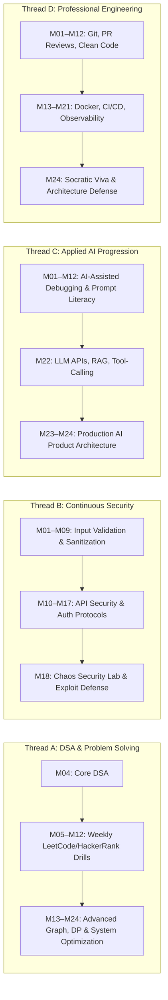

# 🏛️ PINITCAREER — PYTHON FULL-STACK SOFTWARE ENGINEERING
## 12-Month Professional Certificate + 24-Month Professional Advanced Program
### Master Curriculum Architecture, Competency Framework & Product Specification — 2026 Edition

> **DOCUMENT STATUS:** Canonical Production Master Specification (Version 1.0.0 — Frozen).  
> **ALIGNMENT:** ACM/IEEE CS2023, Python Software Foundation (Python 3.14 Baseline), Django 6.x, PostgreSQL 18, OWASP Top 10:2025/2026, AWS Well-Architected Framework.  
> **DEVELOPMENT BATCH CADENCE:** 5 Days per Content Build Batch (`Day 1: Understand`, `Day 2: Apply`, `Day 3: Build`, `Day 4: Debug / Deepen`, `Day 5: Transfer + Assessment`).  
> **INTEGRITY GUARANTEE:** Competency is earned strictly through tamper-evident evidence and un-scaffolded performance assessments — NEVER seat time, video views, or XP.

---

## 1. Product Definitions & Target Outcomes

```
                                  PINITCAREER
                        PYTHON FULL-STACK ENGINEERING
                                      │
                 ┌────────────────────┴────────────────────┐
                 │                                         │
              PROGRAM 1                                 PROGRAM 2
        12-MONTH PROFESSIONAL                     24-MONTH PROFESSIONAL
             CERTIFICATE                                ADVANCED
                 │                                         │
     YEAR 1 (MONTHS 01–12)                     YEAR 2 (MONTHS 13–24)
                 │                                         │
   • Computing Foundations                   • Advanced Django SaaS Architecture
   • Python Core & Application OOP           • PostgreSQL Performance & Redis
   • Problem Solving & Algorithmic Thinking  • Celery Background Workers
   • Web Fundamentals (HTTP/HTML/CSS/JS)     • FastAPI & Async API Engineering
   • Django Full-Stack + PostgreSQL          • WebSockets & Real-Time Sync
   • DRF REST APIs + React (JS-Only)         • Chaos Security Engineering Lab
   • Professional Testing (pytest)           • Docker, CI/CD & AWS Cloud
   • Capstone 1 & Professional Exit Gate     • System Design & Production AI
                 │                           • Specialization Track (A / B / C)
                 │                           • Industry Project / Simulation
                 │                           • Major Capstone & Live Defense
                 ▼                                         ▼
   TARGET GRADUATE COMPETENCY:               TARGET GRADUATE COMPETENCY:
   Independently design, build, test,        Design and reason about scalable
   debug, and deploy standard Python-based   systems, optimize database workloads,
   business web applications.                handle production failures, implement
                                             production AI workflows, and deploy
                                             resilient cloud services.
```

### 1.1 Program 1: PinitCareer Professional Certificate (12 Months)
* **Duration:** 12 Months (48 Active Weeks).
* **Target Audience:** Beginners and career switchers entering software engineering.
* **Target Graduate Competency:** The graduate can independently design, build, test, debug, and deploy standard Python-based business web applications using Django, PostgreSQL, REST APIs, and React (JavaScript-only).
* **Key Exclusions:** No distributed systems architecture, no heavy cloud orchestration, no advanced multi-worker clustering.

### 1.2 Program 2: PinitCareer Professional Advanced Program (24 Months Total)
* **Duration:** 24 Months Total (Year 1 Foundation + Year 2 Advanced Engineering).
* **Target Audience:** Early-career engineers seeking production depth and backend specialization.
* **Target Graduate Competency:** The graduate can design and reason about scalable systems, optimize database workloads, handle realistic production failures, implement production AI workflows, and deploy resilient cloud services.
* **Key Focus:** Deep system mechanics, performance profiling, security defense, asynchronous processing, containerization, and applied AI application engineering.

---

## 2. Core Technology Stack & Architectural Decisions

```
┌─────────────────────────────────────────────────────────────────────────────────────────────────────────┐
│ 🛠️ FROZEN TECHNOLOGY SELECTION MATRIX                                                                   │
├───────────────────────┬──────────────────────────┬──────────────────────────────────────────────────────┤
│ Layer / Discipline    │ Technology Selected      │ Pedagogical Rationale & Problem Solved               │
├───────────────────────┼──────────────────────────┼──────────────────────────────────────────────────────┤
│ Primary Language      │ Python (3.14 Baseline)   │ Core engine across backend, automation, data, AI.    │
├───────────────────────┼──────────────────────────┼──────────────────────────────────────────────────────┤
│ Primary Web Framework │ Django 6.x + DRF         │ Coherent full-stack architecture (ORM, Auth, Admin). │
├───────────────────────┼──────────────────────────┼──────────────────────────────────────────────────────┤
│ Secondary API Engine  │ FastAPI                  │ High-performance async APIs, Pydantic, OpenAPI (Y2). │
├───────────────────────┼──────────────────────────┼──────────────────────────────────────────────────────┤
│ Primary Relational DB │ PostgreSQL 18            │ Industry-standard relational modeling & ACID queries.│
├───────────────────────┼──────────────────────────┼──────────────────────────────────────────────────────┤
│ Caching & Queues      │ Redis 7.x + Celery 5.x   │ Cache-aside, rate limiting, async background tasks.  │
├───────────────────────┼──────────────────────────┼──────────────────────────────────────────────────────┤
│ Core Web Frontend     │ HTML5, CSS3, Vanilla JS  │ Fundamental browser physics, DOM, Fetch API, WCAG.   │
├───────────────────────┼──────────────────────────┼──────────────────────────────────────────────────────┤
│ Frontend Library      │ React (JavaScript-Only)  │ API consumer layer without TypeScript cognitive tax. │
├───────────────────────┼──────────────────────────┼──────────────────────────────────────────────────────┤
│ Testing & Verification│ pytest, pytest-django    │ Unit, integration, API, fixture mocking, regression. │
├───────────────────────┼──────────────────────────┼──────────────────────────────────────────────────────┤
│ DevOps & Cloud        │ Linux, Docker, CI/CD, AWS│ Containerization, pipelines, EC2, S3, RDS, IAM.      │
├───────────────────────┼──────────────────────────┼──────────────────────────────────────────────────────┤
│ Applied AI Layer      │ Python LLM APIs, RAG     │ Embeddings, Vector Search, Tool Calling, Guardrails. │
└───────────────────────┴──────────────────────────┴──────────────────────────────────────────────────────┘
```

### 2.1 Explicit Exclusions & Core Boundaries
* ❌ **NO TypeScript in Core:** Avoids splitting learner attention across two complex type systems. Python type annotations are taught; frontend uses clean modern JavaScript.
* ❌ **NO Node.js Backend:** Python is the sole authoritative backend language.
* ❌ **NO Primary MongoDB:** Relational data integrity (PostgreSQL) is the core standard; NoSQL is covered only as a comparative elective.
* ❌ **NO Heavy Kubernetes/Kafka in Core:** Containerization (Docker) and message queues (Celery/Redis) provide production durability without enterprise cognitive overload.

---

## 3. The 12 Canonical Competency Domains & Mastery Model

```
┌─────────────────────────────────────────────────────────────────────────────────────────────────────────┐
│ 🎯 THE 12 CANONICAL COMPETENCY DOMAINS                                                                  │
├─────────┬──────────────────────────────────┬────────────────────────────────────────────────────────────┤
│ Domain  │ Domain Name                      │ Scope of Measurable Capability                             │
├─────────┼──────────────────────────────────┼────────────────────────────────────────────────────────────┤
│ C1      │ Python Language Engineering      │ Syntax, memory model, OOP, closures, generators, typing.   │
│ C2      │ Problem Solving & DSA            │ Algorithmic reasoning, Big-O, collections, recursion.      │
│ C3      │ Web Foundations & Browser        │ HTTP wire protocol, DOM manipulation, Fetch, responsive UI.│
│ C4      │ Django Full-Stack Engineering    │ Project structure, MVT, ORM, forms, auth, admin, HTMX.     │
│ C5      │ Relational Database Engineering  │ SQL modeling, normalization, indexing, query optimization. │
│ C6      │ REST & Async API Engineering     │ DRF serializers, FastAPI endpoints, Pydantic, OpenAPI.     │
│ C7      │ Testing & Quality Assurance      │ pytest, fixtures, mocking, regression, E2E validation.     │
│ C8      │ Application Security Engineering │ OWASP Top 10 defense, RBAC, input sanitization, cryptography│
│ C9      │ Linux, DevOps & Cloud Ops        │ Shell scripting, Docker, CI/CD pipelines, AWS deployment.  │
│ C10     │ System Design & Reliability      │ Scaling trade-offs, caching, queues, failure isolation.    │
│ C11     │ Applied AI Engineering           │ LLM APIs, structured prompts, embeddings, RAG, tool calling│
│ C12     │ Professional Engineering         │ Git workflows, PR reviews, documentation, architecture defense│
└─────────┴──────────────────────────────────┴────────────────────────────────────────────────────────────┘
```

### 3.1 Five-Level Measurable Mastery Rubric
$$\text{NOT\_ASSESSED} \longrightarrow \text{DEVELOPING} \longrightarrow \text{DEMONSTRATED} \longrightarrow \text{PROFICIENT} \longrightarrow \text{MASTERED}$$

* **NOT_ASSESSED:** No formal evidence recorded in the ledger.
* **DEVELOPING:** Demonstrates conceptual awareness; requires scaffolding or hints during implementation.
* **DEMONSTRATED:** Can solve standard problems independently with clean code and passing tests.
* **PROFICIENT:** Solves novel transfer problems, optimizes performance, and identifies subtle edge cases.
* **MASTERED:** Defends architectural trade-offs, diagnoses production failures, and refactors complex codebases.

---

## 4. 24-Month Month-by-Month Master Progression Map

### 🏛️ YEAR 1: PROFESSIONAL FOUNDATION (Months 01–12)

#### 🔹 Month 01: Computing & Developer Foundations
* **Primary Competency:** C1 (Python Foundations) & C9 (Linux/Terminal Environment).
* **Required Knowledge:** CPU, RAM, storage hierarchy, process lifecycle, environment variables, PATH resolution, virtual environments (`venv`), basic Git commands (`init`, `add`, `commit`, `branch`).
* **Required Practical Ability:** Configure a standardized Linux/macOS/Windows development environment, manage Python packages via `pip`, write CLI automation scripts.
* **Milestone Project 1:** *Developer Environment Diagnostic & System Inspection CLI Tool*.
* **Assessment Mode:** Practical Code Challenge + Environment Configuration Verification.
* **Workload Feasibility:** **BALANCED** (Foundational mental models, low cognitive fatigue).

#### 🔹 Month 02: Python Programming Foundations
* **Primary Competency:** C1 (Python Core).
* **Required Knowledge:** Primitive types, variables, arithmetic/logical expressions, conditionals, `for`/`while` loops, functions, scopes, lists, tuples, dicts, sets, string formatting, basic exception handling (`try`/`except`).
* **Required Practical Ability:** Solve algorithmic and procedural problems cleanly without tutorial reliance; handle user input and write resilient functions.
* **Milestone Project 2:** *Command-Line File Parsing & Business Calculation Utility*.
* **Assessment Mode:** Automated Unit-Tested Coding Challenges + Synthetic Edge Cases.
* **Workload Feasibility:** **BALANCED** (Iterative syntactic drills).

#### 🔹 Month 03: Python Application Engineering & OOP
* **Primary Competency:** C1 (OOP & Packaging) & C7 (Testing Basics).
* **Required Knowledge:** Modules, packages, imports, OOP classes, attributes, methods, inheritance vs composition, encapsulation, file I/O (CSV, JSON), logging framework, custom exceptions.
* **Required Practical Ability:** Structure multi-file Python applications cleanly; write basic `pytest` unit tests; organize reusable modules.
* **Milestone Project 3:** *Modular Multi-Source Inventory & Configuration Management System*.
* **Assessment Mode:** Code Review Audit + Structural OOP Evaluation.
* **Gate 1 Exit Assessment:** **GATE 1: PYTHON FOUNDATION GATE** (Evaluates Months 1–3).
* **Workload Feasibility:** **BALANCED** (Clean OOP design patterns).

#### 🔹 Month 04: Problem Solving & Data Structures
* **Primary Competency:** C2 (DSA & Algorithmic Thinking).
* **Required Knowledge:** Big-O time and space complexity, arrays/lists, stacks, queues, hash maps, linked lists, binary trees, recursion, searching (binary search), sorting algorithms (merge/quick sort).
* **Required Practical Ability:** Select optimal data structures for given constraints; optimize $O(n^2)$ algorithms to $O(n \log n)$ or $O(n)$; debug recursive calls.
* **Milestone Project 4:** *High-Throughput In-Memory Indexing & Route Optimization Engine*.
* **Assessment Mode:** Algorithmic Benchmark Challenges + Space/Time Complexity Defense.
* **Workload Feasibility:** **BALANCED** (Dedicated algorithmic focus; continues as a recurring weekly parallel thread).

#### 🔹 Month 05: Advanced Python Language Mechanics
* **Primary Competency:** C1 (Advanced Python).
* **Required Knowledge:** Closures, custom decorators with arguments, iterators (`__iter__`, `__next__`), generators (`yield`), context managers (`with`, `__enter__`, `__exit__`), list/dict comprehensions, type hints (`typing`), introduction to `asyncio` event loop.
* **Required Practical Ability:** Write reusable decorator utilities; implement memory-efficient streaming generators; construct type-annotated packages.
* **Milestone Project 5:** *High-Performance Stream Processing & Function Instrumentation Library*.
* **Assessment Mode:** Transfer Coding Challenge + Memory Profiling Audit.
* **Workload Feasibility:** **BALANCED** (Focuses purely on Python language depth without framework noise).

#### 🔹 Month 06: Web Foundations & Client-Server Mechanics
* **Primary Competency:** C3 (Web Foundations).
* **Required Knowledge:** Internet mechanics, DNS resolution, TCP/IP basics, HTTP/1.1 wire protocol, HTTP verbs, status codes, headers, cookies, sessions, HTML5 semantics, CSS3 Flexbox/Grid, Vanilla JavaScript DOM manipulation, Fetch API, Promises, `async`/`await`.
* **Required Practical Ability:** Construct responsive, accessible web pages; consume external JSON APIs with Vanilla JS; handle HTTP error responses gracefully.
* **Milestone Project 6:** *Accessible Interactive Web Dashboard with Real-Time Data Fetching*.
* **Gate 2 Exit Assessment:** **GATE 2: WEB FOUNDATIONS GATE** (Evaluates Months 4–6).
* **Workload Feasibility:** **BALANCED** (Browser physics and protocol clarity).

#### 🔹 Month 07: Django Framework Foundations
* **Primary Competency:** C4 (Django Engineering).
* **Required Knowledge:** Django MVT architecture, project structure, `settings.py`, apps, URL dispatching, function-based and class-based views, Django template engine, static files, models, migrations, Django admin customisation.
* **Required Practical Ability:** Scaffold a multi-app Django project from scratch, design normalized models, run migrations, render dynamic database-driven templates.
* **Milestone Project 7:** *Database-Backed Multi-Role Content & Organization Management Portal*.
* **Assessment Mode:** Practical Django Build Challenge + Migration Integrity Test.
* **Workload Feasibility:** **BALANCED** (Framework fundamentals).

#### 🔹 Month 08: PostgreSQL & Relational Data Modeling
* **Primary Competency:** C5 (Database Engineering) & C4 (Django ORM).
* **Required Knowledge:** Relational algebra, SQL DDL/DML, primary/foreign keys, unique/check constraints, normalization (1NF, 2NF, 3NF), INNER/LEFT/OUTER joins, aggregations (`GROUP BY`, `HAVING`), transactions (ACID), B-tree indexes, Django ORM query optimization (`select_related`, `prefetch_related`, `F` and `Q` expressions).
* **Required Practical Ability:** Design complex schemas, write raw SQL queries, eliminate N+1 query bugs in Django ORM, enforce database-level data integrity.
* **Milestone Project 8:** *Relational Financial Transaction Ledger & Query Optimization Suite*.
* **Assessment Mode:** SQL Benchmark + N+1 ORM Diagnostics Challenge.
* **Workload Feasibility:** **BALANCED** (Deep database engineering).

#### 🔹 Month 09: Django Full-Stack Web Applications
* **Primary Competency:** C4 (Django Full-Stack) & C8 (Application Security Basics).
* **Required Knowledge:** Complete CRUD workflows, Django authentication and user model customization, RBAC permissions, Django forms and model forms, CSRF protection, session security, secure file uploads, pagination, search filters, HTMX for dynamic partial updates.
* **Required Practical Ability:** Build a secure, full-stack business application with role-based access control, file storage, and responsive UI without page reloads.
* **Milestone Project 9:** *Enterprise B2B Resource Booking & Operations Management System*.
* **Gate 3 Exit Assessment:** **GATE 3: FULL-STACK FOUNDATION GATE** (Evaluates Months 7–9).
* **Workload Feasibility:** **BALANCED** (Synthesizes Django + PostgreSQL + Security).

#### 🔹 Month 10: API Engineering & React Frontend Integration
* **Primary Competency:** C6 (API Engineering) & C3 (React UI).
* **Required Knowledge:** REST architecture, Django REST Framework (DRF), API views, serializers, ModelSerializers, JWT authentication, permissions, pagination, filtering, React components, state, props, hooks (`useState`, `useEffect`), Axios/Fetch integration.
* **Required Practical Ability:** Expose secure RESTful endpoints from Django; build a decoupled React (JavaScript-only) single-page application that consumes the Django APIs.
* **Milestone Project 10:** *Decoupled SaaS Product: Django DRF Backend + React Client*.
* **Assessment Mode:** Full-Stack API Contract & Frontend Integration Defense.
* **Workload Feasibility:** **BALANCED** (React is treated strictly as an API consumer in plain JS).

#### 🔹 Month 11: Professional Testing & Engineering Workflows
* **Primary Competency:** C7 (Testing) & C12 (Professional Workflows).
* **Required Knowledge:** `pytest`, `pytest-django`, test fixtures, database test isolation, mocking external APIs, test coverage analysis, Git branching workflows (GitFlow/trunk-based), Pull Request reviews, CI automation with GitHub Actions, technical documentation.
* **Required Practical Ability:** Write comprehensive unit and integration test suites for Django applications; conduct peer PR reviews; configure automated test CI pipelines.
* **Milestone Project 11:** *Team-Maintained Open-Source Application with 90%+ Integration Test Suite*.
* **Assessment Mode:** PR Review Simulation + Code Quality & Test Coverage Audit.
* **Workload Feasibility:** **BALANCED** (Testing discipline).

#### 🔹 Month 12: Professional Certificate Capstone & Defense
* **Primary Competency:** Comprehensive Synthesis (C1–C9, C12).
* **Required Knowledge:** Full synthesis of Year 1 engineering: Python, Django, PostgreSQL, DRF, React, pytest, Security, Git, Docker basics.
* **Required Practical Ability:** Independently architect, build, test, secure, and deploy a complete production-grade web application from a raw business specification.
* **Major Milestone Project 12:** *Professional Certificate Full-Stack SaaS Capstone*.
* **Gate 4 Exit Assessment:** **GATE 4: PROFESSIONAL CERTIFICATE EXIT GATE** (Theory 15%, Practical 35%, Debugging 15%, Project 25%, Live Viva 10%).
* **Credential Issued:** **PINITCAREER PROFESSIONAL CERTIFICATE IN PYTHON FULL-STACK SOFTWARE ENGINEERING**.
* **Workload Feasibility:** **BALANCED** (Dedicated capstone build and live defense).

---

### 🏛️ YEAR 2: PROFESSIONAL ADVANCED PROGRAM (Months 13–24)

#### 🔹 Month 13: Advanced Django SaaS Architecture & Modular Design
* **Primary Competency:** C4 (Advanced Django) & C10 (Architecture).
* **Required Knowledge:** Modular Django app architecture, Service Layer pattern, domain logic decoupling from views/models, custom middleware, signals vs explicit service calls, custom model managers/querysets, multi-tenancy strategies (schema vs row isolation).
* **Required Practical Ability:** Refactor monolithic Django apps into decoupled service-oriented modules; implement custom middleware for request telemetry and security headers.
* **Milestone Project 13:** *Multi-Tenant B2B SaaS Platform with Clean Service Layer Architecture*.
* **Assessment Mode:** Architecture Refactoring Challenge + Modular Boundary Audit.
* **Workload Feasibility:** **BALANCED** (Software design patterns in Python).

#### 🔹 Month 14: PostgreSQL Performance Engineering & Redis Caching
* **Primary Competency:** C5 (Database Performance) & C10 (Caching).
* **Required Knowledge:** `EXPLAIN (ANALYZE, BUFFERS)` execution plans, sequential scans vs index scans, composite indexes, partial indexes, connection pooling (PgBouncer), database locking and isolation levels, Redis data structures (strings, hashes, sets, sorted sets), Cache-Aside pattern, cache invalidation strategies, Redis rate limiting.
* **Required Practical Ability:** Diagnose and optimize slow queries in PostgreSQL; implement high-performance caching layers in Django/Python; prevent cache stampedes.
* **Milestone Project 14:** *High-Concurrency Data Processing Benchmark & Query Optimization Lab*.
* **Assessment Mode:** Performance Optimization Challenge (Optimize slow app by >10x).
* **Workload Feasibility:** **BALANCED** (Deep database and caching mechanics).

#### 🔹 Month 15: Background Processing & Asynchronous Task Queues
* **Primary Competency:** C10 (Background Processing) & C1 (Async Python).
* **Required Knowledge:** Asynchronous message brokers (Redis), Celery worker architecture, task scheduling (Celery Beat), task states and results backend, retries with exponential backoff, dead-letter queues, task idempotency patterns, handling worker failures and poison pills.
* **Required Practical Ability:** Offload long-running computations, email pipelines, and report generation to Celery workers; write idempotent tasks resilient to crashes.
* **Milestone Project 15:** *Fault-Tolerant Distributed Document Processing & Notification Engine*.
* **Assessment Mode:** Chaos Worker Failure Injection Challenge + Idempotency Verification.
* **Workload Feasibility:** **BALANCED** (Distributed worker mastery).

#### 🔹 Month 16: FastAPI & High-Performance Async API Engineering
* **Primary Competency:** C6 (FastAPI & Async APIs).
* **Required Knowledge:** `async`/`await` event loop mechanics, FastAPI architecture, Pydantic v2 schemas and validation, Dependency Injection system, asynchronous database drivers (`asyncpg`, SQLAlchemy Async ORM), OpenAPI generation, background tasks in FastAPI, Django DRF vs FastAPI trade-offs.
* **Required Practical Ability:** Build high-throughput asynchronous micro-APIs; implement strict request/response data contracts; integrate async connection pools.
* **Milestone Project 16:** *High-Throughput Real-Time Telemetry Ingestion API in FastAPI*.
* **Assessment Mode:** Async API Load Test Benchmark + Type Contract Verification.
* **Workload Feasibility:** **BALANCED** (FastAPI introduced after full backend maturity).

#### 🔹 Month 17: Real-Time Communication & Streaming Systems
* **Primary Competency:** C6 (Real-Time APIs) & C10 (Event Streaming).
* **Required Knowledge:** Server-Sent Events (SSE), WebSockets protocol, connection lifecycle management, heartbeat/ping-pong, reconnect and replay strategies, Django Channels, Redis Pub/Sub integration.
* **Required Practical Ability:** Implement bi-directional real-time communication channels; broadcast events to thousands of connected clients; handle network partitions.
* **Milestone Project 17:** *Real-Time Collaborative Multi-User Workspace & Live Event Streaming System*.
* **Assessment Mode:** Real-Time Synchronization & Network Disconnection Stress Test.
* **Workload Feasibility:** **BALANCED** (Event-driven architectures).

#### 🔹 Month 18: Application Security Engineering & Chaos Defense Lab
* **Primary Competency:** C8 (Application Security Engineering).
* **Required Knowledge:** OWASP Top 10 (Broken Access Control, Injection, SSRF, Insecure Deserialization, Cryptographic Failures), OAuth2/OIDC flows, JWT security pitfalls, Object-Level Permissions, rate limiting, SQL injection defense, CSRF/XSS exploitation mechanics, dependency vulnerability scanning (`pip-audit`, Snyk).
* **Required Practical Ability:** Audit intentionally vulnerable web apps; safely reproduce security exploits; patch vulnerabilities across backend and database; write regression security tests.
* **Milestone Project 18:** *Chaos Security Lab: Vulnerability Exploit & Hardening Challenge*.
* **Gate 5 Exit Assessment:** **GATE 5: BACKEND & SECURITY GATE** (Evaluates Months 13–18).
* **Workload Feasibility:** **BALANCED** (Hands-on security penetration and defense).

#### 🔹 Month 19: Testing, Reliability & Observability Engineering
* **Primary Competency:** C7 (Reliability) & C10 (Observability).
* **Required Knowledge:** Chaos engineering concepts, failure injection, circuit breaker pattern, graceful degradation, structured JSON logging, distributed tracing basics, health check endpoints, Prometheus metrics instrumentation, error tracking (Sentry).
* **Required Practical Ability:** Instrument production telemetry across Django and FastAPI apps; configure alerting thresholds; test application recovery under database/network outages.
* **Milestone Project 19:** *Production Observability Dashboard & Chaos Resilience Harness*.
* **Assessment Mode:** Chaos Outage Recovery Challenge + Incident Post-Mortem Defense.
* **Workload Feasibility:** **BALANCED** (Site reliability engineering principles).

#### 🔹 Month 20: Linux Administration, Docker & CI/CD Pipelines
* **Primary Competency:** C9 (DevOps & Containers).
* **Required Knowledge:** Linux process management, permissions, SSH hardening, multi-stage Docker builds for Python, Docker Compose for multi-container development (App + DB + Redis + Worker), automated CI/CD pipelines (GitHub Actions), linting, security scanning, container image registries.
* **Required Practical Ability:** Write production-grade `Dockerfile`s with minimal attack surface; orchestrate multi-container staging environments; build automated deployment pipelines.
* **Milestone Project 20:** *Fully Containerized Multi-Service Production Deployment Pipeline*.
* **Assessment Mode:** Docker Multi-Container Configuration & CI Pipeline Automation Audit.
* **Workload Feasibility:** **BALANCED** (Container and deployment mastery).

#### 🔹 Month 21: AWS Cloud & Production Infrastructure
* **Primary Competency:** C9 (Cloud Infrastructure).
* **Required Knowledge:** AWS Core Services: EC2, S3, RDS PostgreSQL, VPC networking, security groups, IAM roles and least privilege, Route 53 DNS, SSL/TLS certificates (ACM), application deployment (AWS App Runner / ECS / Elastic Beanstalk), automated database backups.
* **Required Practical Ability:** Provision cloud infrastructure securely; deploy containerized Python applications to AWS; configure database replication and secure secrets management (AWS Secrets Manager / Parameter Store).
* **Milestone Project 21:** *Production Cloud Deployment with Automated Backups & SSL*.
* **Gate 6 Exit Assessment:** **GATE 6: PRODUCTION ENGINEERING GATE** (Evaluates Months 19–21).
* **Workload Feasibility:** **BALANCED** (Practical AWS cloud deployment).

#### 🔹 Month 22: System Design & Production AI Application Engineering
* **Primary Competency:** C10 (System Design) & C11 (Applied AI).
* **Workload Mitigation Strategy:** To ensure balanced cognitive load, Month 22 is structured with clear weekly boundaries:
  * *Week 1:* System Design Fundamentals (Scalability, Latency vs Throughput, CAP Theorem, Database Sharding vs Replication).
  * *Week 2:* Python LLM APIs, Structured Outputs (Pydantic), and Robust Prompt Engineering.
  * *Week 3:* Embeddings, Vector Databases (pgvector / Chroma), and Retrieval-Augmented Generation (RAG).
  * *Week 4:* Tool Calling, Agent Workflows, AI Guardrails, and Output Evaluation.
* **Required Practical Ability:** Design scalable system architectures; build production Python RAG pipelines that query enterprise documentation with verified citations.
* **Milestone Project 22:** *Enterprise RAG Knowledge Assistant & System Architecture Blueprint*.
* **Assessment Mode:** System Design Defense + RAG Retrieval Evaluation Challenge.
* **Workload Feasibility:** **BALANCED** (Structured week-by-week progression).

#### 🔹 Month 23: Specialization Track & Industry Project / Simulation
* **Primary Competency:** Specialized Domain Mastery (Track A, B, or C) & C12 (Industry Collaboration).
* **Specialization Selection (Learner selects ONE track):**
  * **Track A (Advanced Backend & Cloud):** Distributed task workflows, gRPC, advanced async pipelines, AWS infrastructure scaling.
  * **Track B (AI-Enabled Full Stack):** Multi-modal LLM applications, agentic workflows, autonomous tool-use, production AI observability.
  * **Track C (Product Full Stack):** Advanced React UI architecture, client-side state machines, performance profiling, real-time UX.
* **Industry Component:** Real external client engagement (`INDUSTRY_PROJECT`) OR controlled enterprise simulation (`INDUSTRY_SIMULATION`).
* **Gate 7 Exit Assessment:** **GATE 7: ADVANCED ENGINEERING & SPECIALIZATION GATE** (Evaluates Months 22–23).
* **Workload Feasibility:** **BALANCED** (Focused track execution).

#### 🔹 Month 24: Major Independent Capstone & Live Architecture Defense
* **Primary Competency:** Complete Autonomous Engineering Synthesis (C1–C12).
* **The 13-Phase Independent Capstone Process:**
  1. *Phase 1:* Problem Interpretation & Domain Discovery
  2. *Phase 2:* Formal Requirements Specification
  3. *Phase 3:* System Architecture & Database Schema Design
  4. *Phase 4:* Core Backend Implementation (Django / FastAPI + PostgreSQL)
  5. *Phase 5:* Frontend Client Implementation (React / JS)
  6. *Phase 6:* Asynchronous Processing & Caching Integration (Celery + Redis)
  7. *Phase 7:* Applied AI Integration (where relevant to business domain)
  8. *Phase 8:* Automated Test Suite (Unit + Integration + API >80% coverage)
  9. *Phase 9:* Security Audit & Vulnerability Hardening
  10. *Phase 10:* Containerization & Cloud Deployment (Docker + AWS + HTTPS)
  11. *Phase 11:* Production Telemetry & Logging Setup
  12. *Phase 12:* Unannounced Chaos / Failure Injection Challenge
  13. *Phase 13:* Live Architecture Defense & Socratic Viva
* **Final Exit Assessment:** **FINAL CAPSTONE & ARCHITECTURE DEFENSE GATE**.
* **Credential Issued:** **PINITCAREER PROFESSIONAL ADVANCED DIPLOMA IN PYTHON FULL-STACK SOFTWARE ENGINEERING**.
* **Workload Feasibility:** **BALANCED** (Dedicated capstone sprint with structured checkpoints).

---

## 5. Canonical Concept Registry & No-Repeat Progression Rules

```
┌─────────────────────────────────────────────────────────────────────────────────────────────────────────┐
│ 📚 CANONICAL CONCEPT REGISTRY & NO-REPEAT PROGRESSION RULES                                             │
├──────────────────┬──────────────┬──────────────────┬────────────────────────────────────────────────────┤
│ Concept Domain   │ Canonical M. │ Initial Depth    │ Progressive Deepening (No Introductory Repeats)   │
├──────────────────┼──────────────┼──────────────────┼────────────────────────────────────────────────────┤
│ Functions & Scope│ Month 02     │ Syntax, params,  │ M05: Closures, decorators, generators.             │
│                  │              │ return, globals. │ M13: Service layer boundary design.                │
│                  │              │                  │ M16: FastAPI dependency injection.                 │
├──────────────────┼──────────────┼──────────────────┼────────────────────────────────────────────────────┤
│ Database & SQL   │ Month 08     │ Relational DDL,  │ M09: Django ORM integration & forms.               │
│                  │              │ normalization,   │ M14: EXPLAIN query plans, indexes, Redis caching.  │
│                  │              │ joins, CRUD.     │ M22: pgvector embeddings & vector search.          │
├──────────────────┼──────────────┼──────────────────┼────────────────────────────────────────────────────┤
│ Authentication   │ Month 09     │ Django Sessions, │ M10: JWT tokens for REST APIs.                     │
│                  │              │ custom User model│ M18: OAuth2/OIDC, CSRF, RBAC, token security.      │
│                  │              │ RBAC decorators. │ M21: AWS IAM least-privilege policies.             │
├──────────────────┼──────────────┼──────────────────┼────────────────────────────────────────────────────┤
│ Asynchrony &     │ Month 05     │ Introduction to  │ M15: Celery background worker queues & Redis.      │
│ Concurrency      │              │ asyncio basics.  │ M16: FastAPI async endpoints & asyncpg.            │
│                  │              │                  │ M17: WebSockets & real-time event streaming.       │
├──────────────────┼──────────────┼──────────────────┼────────────────────────────────────────────────────┤
│ Testing & QA     │ Month 03     │ Basic pytest     │ M11: pytest-django, fixtures, mocking, CI/CD.      │
│                  │              │ unit assertions. │ M18: Security exploit regression tests.            │
│                  │              │                  │ M19: Chaos failure injection & reliability tests.  │
└──────────────────┴──────────────┴──────────────────┴────────────────────────────────────────────────────┘
```

---

## 6. The Four Continuous Parallel Engineering Threads



---

## 7. The 10 Major Milestone Projects Progression

```
┌─────────────────────────────────────────────────────────────────────────────────────────────────────────┐
│ 🚀 10 MAJOR MILESTONE PORTFOLIO PROJECTS                                                                │
├────┬─────────────────────────────┬────────────┬────────────────────────────┬────────────────────────────┤
│ #  │ Project Title               │ Month      │ Core Technologies          │ Non-Trivial Challenge      │
├────┼─────────────────────────────┼────────────┼────────────────────────────┼────────────────────────────┤
│ 1  │ Developer CLI Diagnostics   │ Month 01   │ Python, OS/Sys, Subprocess │ Cross-platform environment │
│ 2  │ Stream Data Transformation  │ Month 05   │ Python, Generators, Typing │ Memory-efficient streaming │
│ 3  │ Accessible Web Dashboard    │ Month 06   │ HTML5, CSS3 Grid, JS Fetch │ WCAG 2.2 AA accessibility  │
│ 4  │ Django B2B Operations Portal│ Month 09   │ Django, PostgreSQL, HTMX   │ Complex RBAC & ORM queries │
│ 5  │ Decoupled SaaS Web App      │ Month 10   │ DRF, PostgreSQL, React(JS) │ JWT auth & state syncing   │
│ 6  │ Year 1 Capstone Application │ Month 12   │ Full Year 1 Stack          │ Complete unassisted build  │
│ 7  │ High-Concurrency Cache Lab  │ Month 14   │ PostgreSQL, Redis, EXPLAIN │ 10x query latency reduction│
│ 8  │ Fault-Tolerant Worker Engine│ Month 15   │ Celery, Redis, Python      │ Idempotency & crash recovery│
│ 9  │ Chaos Security Defense Lab  │ Month 18   │ Django, FastAPI, OWASP     │ Exploit patch & regression │
│ 10 │ Production Cloud Capstone   │ Month 24   │ Full 24-Month Stack + AWS  │ 13-Phase live defense      │
└────┴─────────────────────────────┴────────────┴────────────────────────────┴────────────────────────────┘
```

---

## 8. Development Cadence: The 5-Day Build Batch Standard

From this point forward, content creation is authored in **Strict 5-Day Development Batches**:

```
┌─────────────────────────────────────────────────────────────────────────────────────────────────────────┐
│ 📅 5-DAY CONTENT BATCH STRUCTURE                                                                        │
├────────────┬─────────────────────────┬──────────────────────────────────────────────────────────────────┤
│ Day Number │ Pedagogical Intent      │ Core Learning Content & Artifacts Produced                       │
├────────────┼─────────────────────────┼──────────────────────────────────────────────────────────────────┤
│ Day 1      │ UNDERSTAND (Theory)     │ Mental models, architectural diagrams, common pitfalls, checks.  │
│ Day 2      │ APPLY (Guided Lab)      │ Step-by-step code exercises, guided implementation, syntax drills│
│ Day 3      │ BUILD (Independent)     │ Unassisted feature build, real-world code integration.           │
│ Day 4      │ DEBUG / DEEPEN (Chaos)  │ Broken code scenarios, root-cause investigation, failure fixes.  │
│ Day 5      │ TRANSFER + ASSESSMENT   │ Unfamiliar domain challenge, formal assessment, evidence record. │
└────────────┴─────────────────────────┴──────────────────────────────────────────────────────────────────┘
```

---

## 9. Industry Engagement & Evidence Taxonomy

To maintain institutional credibility, evidence is categorized into three unambiguous tiers:

1. **`VERIFIED_EXTERNAL_INTERNSHIP`**: Certified real-world corporate internship with external mentor sign-off.
2. **`INDUSTRY_PROJECT`**: Actual client engagement with real external stakeholders, requirements, and deliverables.
3. **`INDUSTRY_SIMULATION`**: Rigorous, enterprise-grade simulation designed by PinIT faculty reproducing authentic workplace constraints.

> [!IMPORTANT]
> A simulation must NEVER be marketed or labeled as an internship. This protects the integrity and market standing of PinIT graduates.

---

## 10. Audit of Existing BUILDS 01–04 against 2026 Master Plan

```
┌─────────────────────────────────────────────────────────────────────────────────────────────────────────┐
│ 🔍 RECONCILIATION OF BUILDS 01–04                                                                       │
├───────────┬───────────────────────────────┬─────────────────────────────────────────────────────────────┤
│ Build #   │ Infrastructure Component      │ Reconciliation Status & Action Required                     │
├───────────┼───────────────────────────────┼─────────────────────────────────────────────────────────────┤
│ BUILD 01  │ Curriculum Infrastructure     │ ✅ COMPATIBLE: Update `curriculumSpine.ts` to 24-month/     │
│           │                               │ 8-phase structure. Hierarchy validation logic is preserved. │
├───────────┼───────────────────────────────┼─────────────────────────────────────────────────────────────┤
│ BUILD 02  │ Content Engine                │ ✅ COMPATIBLE: Supports 11 polymorphic content blocks.      │
│           │                               │ Extend manifest validators to support 5-day batch intents.  │
├───────────┼───────────────────────────────┼─────────────────────────────────────────────────────────────┤
│ BUILD 03  │ Assessment Engine             │ ✅ COMPATIBLE: 3-tier test cases, rubrics, critical failures│
│           │                               │ are fully preserved. Formative status preserved.            │
├───────────┼───────────────────────────────┼─────────────────────────────────────────────────────────────┤
│ BUILD 04  │ Evidence Ledger               │ ✅ COMPATIBLE: Append-only hash chaining, provenance,       │
│           │                               │ PostgreSQL RLS, and revocation audit events fully preserved.│
└───────────┴───────────────────────────────┴─────────────────────────────────────────────────────────────┘
```

---

## 11. Final Specification Status

```
===========================================================================================================
MASTER CURRICULUM: APPROVED
===========================================================================================================
```
* The 12-Month Professional Certificate + 24-Month Professional Advanced Program architecture is **officially frozen**.
* Zero premature lessons or arbitrary content have been generated.
* The system is ready to proceed to content development following the **5-Day Batch Delivery Model**.
