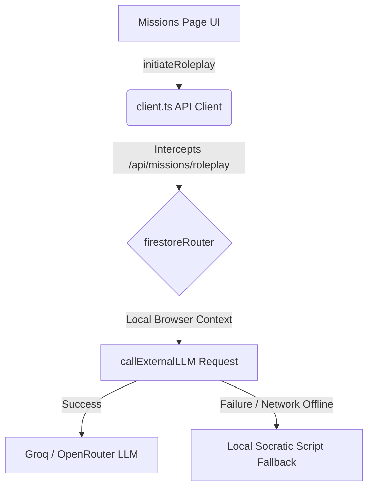

# Mindset Evolution Simulator & Daily Missions (Missions Tab)

The **Missions Tab (`/missions`)** implements a state-of-the-art **Mindset Persona Simulator** designed to challenge, refine, and evolve Socratic critical thinking (System 2 check) in software engineering candidates. 

It exposes candidates to real-life workplace crises (critical outages, authority pressure, scope creep, blame-shifting) driven by their personal digital twin Consistency Index onboarding score (`qt2_score`).

---

## 1. System Architecture & Client-Side Interception

To guarantee compatibility with **Firebase Static Hosting** (where Next.js server-side API routes are disabled), the dynamic simulator utilizes a client-side routing fallback framework:

- **Client Interception (`client.ts`):** Intercepts POST calls to `/api/missions/roleplay` and processes them in the browser using the client-side LLM executor `callExternalLLM`.
- **Resilient Fallbacks:** In case of API rate limits or network issues, the system catches errors and drops back to high-fidelity, context-aware mock Socratic scenarios, preventing simulation crashes.

---

## 2. Immersive Full-Screen Layout

To promote deep concentration and simulate high-pressure Socratic drills, the interface transitions into a zero-distraction focus environment when a session is active:

1. **Sidebar Collapse:** The global application sidebar collapses immediately (`width: 0`).
2. **Topbar Concealment:** The global user dashboard header topbar is hidden (`display: none`).
3. **Stat Card Hiding:** Hides the daily streak calendar, XP counters, and sub-tab selection bar.
4. **Telemetry Height Constraint:** Constrains the 3D VRoid Telemetry Live Feed container strictly to `380px` height. This prevents infinite render loop canvas reflows, ensuring WebGL context stability.
5. **Auto-Restoration:** Restores the entire dashboard frame instantly when the session is aborted or the final Socratic Evolution Report is closed.

---

## 3. Avatar Mappings & Kitten TTS Vocal Engine

Avatars are assigned specific 3D humanoid GLB assets and vocal weights to match their character profiles:

### Mappings Presets
| Character ID | Name | Role / Profile | Model Assignment | Voice Preset (Kokoro) | Kitten TTS Index |
| :--- | :--- | :--- | :--- | :--- | :--- |
| **priya** | Ms. Priya | Friendly Mentor | `hana.glb` | `af_heart` (US Warm Female) | 0 (Bella) |
| **anish** | Mr. Anish | Casual Mentor | `riku.glb` | `am_liam` (US Friendly Male) | 5 (Hugo) |
| **aisha** | Ms. Aisha | Structured Teacher | `yuki.glb` | `af_sky` (US Clear Female) | 2 (Luna) |
| **rohan** | Mr. Rohan | Energetic Teacher | `akira.glb` | `am_fenrir` (US Clean Male) | 1 (Jasper) |
| **kashyap** | Mr. Kashyap | Architect Teacher | `sora.glb` | `am_fenrir` (US Clean Male) | 1 (Jasper) |
| **karthic** | Mr. Karthic | Algo Lead Teacher | `sora.glb` | `am_liam` (US Friendly Male) | 3 (Bruno) |
| **maya** | Ms. Maya | Security Teacher | `yuki.glb` | `bf_emma` (UK Prof. Female) | 2 (Luna) |
| **divya** | Ms. Divya | UX Expert Teacher | `mika.glb` | `af_nicole` (US Creative Female) | 4 (Rosie) |
| **vikram** | Mr. Vikram | Strict Interviewer | `kaito.glb` | `bm_lewis` (UK Strict Male) | 3 (Bruno) |
| **shalini** | Ms. Shalini | Observer Interviewer | `rei.glb` | `bf_isabella` (UK Prof. Female) | 2 (Luna) |
| **aditya** | Mr. Aditya | Design Purist | `sora.glb` | `am_adam` (US Wise Male) | 5 (Hugo) |
| **neha** | Ms. Neha | Stress Driller | `mika.glb` | `af_bella` (US Energetic Female) | 6 (Kiki) |
| **rajesh** | Mr. Rajesh | Legacy Defender | `riku.glb` | `am_liam` (US Friendly Male) | 7 (Leo) |
| **sneha** | Ms. Sneha | Socratic Interviewer | `hana.glb` | `af_sarah` (US Socratic Female) | 0 (Bella) |
| **abhijit** | Mr. Abhijit | Bored Executive | `kaito.glb` | `bm_george` (UK Bored Male) | 1 (Jasper) |

### Prioritized Local Kitten TTS Voice Engine
To eliminate cold start latency (~90MB model community downloads for Kokoro Community), the system boots **KittenTTS** (a lightweight ~24MB Nano model) as its primary speech engine:
- **Background Pre-loading:** Triggers model loading inside the Web Worker (`tts-worker.js`) as soon as the missions page mounts.
- **WASM Warm-up:** Runs a zero-character audio generation warm-up during initialization to compile WebAssembly execution kernels before the first user sentence is spoken.
- **Extended Timeout Bounds:** The generation race timeout has been increased to `5.0s` to prevent audio synthesize fallbacks on slow devices.

---

## 4. Socratic Framework & Layout Upgrades (July 2026)

The simulation engine has been upgraded to a **"God-Level" Socratic crisis framework** featuring advanced visual telemetry and realistic dialogue structures:

### A. Telemetry & Stress Tracking (UI)
* **⚡ Cognitive Stress Index:** Renders a real-time, dynamic stress telemetry bar inside the 3D feed column. Choosing rushed, panic-induced System 1 options increases the user's stress index by `+15%` (triggering yellow/red visual alerts), while calm, analytical System 2 choices decrease stress load.
* **⏳ Speaking-Aware Timer Freeze:** The 25-second countdown timer dynamically freezes at `25s` while the active avatar is speaking the TTS audio. The countdown starts ticking down only *after* the audio completes, ensuring the user has the full 25 seconds to evaluate the complex, long choices.

### B. Dialogue Escalation & Multi-Agent Scripting
* **🔄 8-Turn Dynamic Progression:** Increased the simulator crisis depth from 4 to **8 turns** to deliver an immersive, long-lasting (~7+ minutes) assessment.
* **🎭 Group Interjections:** Avatars now interrupt and interject dynamically in a screenplay style (e.g. Abhijit demanding an release roadmap right as Rohan points out a git blocker), raising candidate social pressure.
* **🧠 Toughened Choice Trade-offs:** Upgraded the Groq orchestrator fallback to `llama-3.3-70b-versatile` and hardened the choice architecture. Options represent subtle, high-level corporate trade-offs (e.g., speed vs long-term database write-skew stability) rather than generic options.

### C. Immersive Full-Screen Coverage
* **📐 Expanded Viewport Width (95%):** collides with the global shell to collapse sidebars and topbars immediately on startup, expanding content maximum width to `95%` (equivalent to Zoom boardroom layouts).
* **👁️ Global Mentor Auto-Hide:** Automatically hides the global floating mentor circle in the bottom right corner when a simulator session starts, preventing visual overlaps.
