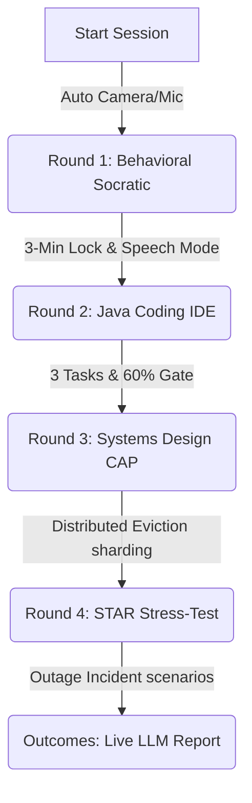

# AI Technical Interview Workspace

An immersive, screen-optimized mock interview portal that evaluates software engineering candidates using client-side telemetry combined with a socratic LLM evaluator.

---

## 🛠️ Technology Stack
*   **Frontend:** Next.js, React, Vanilla CSS.
*   **Perception AI (Client):** Google MediaPipe Face Mesh (WebGL-accelerated 478 landmarks tracking).
*   **Audio Transcription:** Browser Web Speech API (`SpeechRecognition`).
*   **LLM Brain & Orchestrator:** Groq API (Llama / Claude models).
*   **Deployment:** Firebase Hosting.

---

## ⚡ Setup Requirements
1.  **Hardware:** Active Webcam & Microphone inputs.
2.  **Permissions:** Browser permissions allowed for camera/mic capture on workspace loading.
3.  **Client Environment:** Modern web browser supporting WebGL and Web Speech Recognition.

---

## 🔄 Core Assessment Workflow

1.  **Round 1 (Behavioral):** Chat dynamically using speech-to-speech or text. Sifted by a 3-minute timer gate.
2.  **Round 2 (Coding):** Solve 3 progressive Java code challenges. A collective score of $\ge 60\%$ is required to pass.
3.  **Round 3 (Systems Design):** Socratic scaling checks regarding distributed caching (LRU/LFU) and sharding trade-offs.
4.  **Round 4 (STAR Framework):** Stress-testing on production outages and incident post-mortems.
5.  **Outcomes Report:** Aggregates your actual gaze, blink, posture, and speaking pace telemetry. The Groq LLM brain evaluates the transcript text to generate a dynamic hiring verdict and coaching feedback.
