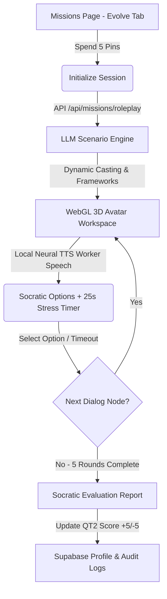

# 🧠 3D Role-Play Persona Evolution Simulator (Missions Tab)

An immersive, gamified workspace inside PinIT Career OS that replaces passive text-based daily checklists with fully dynamic, AI-generated 3D corporate crisis role-play scenarios.

---

## 🛠️ System Architecture & Workflow

1. **Initiation:** The user spends **5 Pins** (consuming standard tokens) to boot the simulator.
2. **Context Selection:** The system queries the user's `qt2_score` (Cognitive Mindset score from onboarding) to adapt the scenario:
   - **Low QT2 (<75):** Standard, educational situations with clear instructions.
   - **High QT2 (>=85):** High-stakes, manipulative, or critical crisis events with active deception/gaslighting.
3. **WebGL & Speech Synchronization:** Dynamic Three.js canvas displays the active avatar (`VRoidInterviewAvatar`), shifting focus and expressions (`thinking`, `talking`, `shrug`, `nod`) procedurally synchronized with local neural voice playbacks.
4. **Stress Timer:** Users must select a response card in under **25 seconds**. If the timer runs out, the system automatically triggers the worst option representing a panicked cognitive bias reaction.
5. **Evaluation & Rewarding System:** At the end of the 5-round simulation (~6-7 minutes), the AI evaluator compiles a detailed Socratic report. Programmatic delta scores are calculated:
   - **Mindset score (`qt2_score`):** Updated between -5 and +5 based on cumulative performance.
   - **Key Persona Metrics:** `communication_score`, `execution_score`, `leadership_score`, and `intelligence_score` are dynamically updated (clamped between 30 and 100) and synced to the database via `PATCH /api/auth/profile`.
   - **XP & Pins:** Awards **+50 XP** and **+10 Pins** on successful completion.
   - **Live Reload:** Invokes the authentication context `refresh()` to automatically update radar charts and progress values on the student dashboard and Career DNA views.

---

## 📚 Mindset & Strategic Frameworks (R&D)

The simulator is powered by a dynamic engine that selects and maps dialogue nodes to strategic principles from prominent cognitive, psychological, and business books:

*   **Thinking, Fast and Slow** *(Daniel Kahneman)*: Checks System 1 (intuitive/biased) vs System 2 (analytical/deliberate) decision-making under stress.
*   **Extreme Ownership** *(Jocko Willink)*: Tests if the user takes absolute accountability for team/subordinate failures or attempts to deflect blame.
*   **33 Strategies of War** *(Robert Greene)*: Teaches defensive maneuvers, counter-offensives, and spotting political sabotage in competitive corporate setups.
*   **The Art of Seduction** *(Robert Greene)*: Trains the user to resist manipulative charm, boundary compromises, and client-side scope creep.
*   **Influence: The Psychology of Persuasion** *(Robert Cialdini)*: Drills resistance against authority bias, artificial scarcity, and social proof fallacies.
*   **The Millionaire Fastlane** *(MJ DeMarco)*: Evaluates if the user adopts a proactive, high-agency producer mindset or falls into passive consumer habits.
*   **The Black Swan** *(Nassim Nicholas Taleb)*: Evaluates response metrics during unpredictable, high-impact emergency outages.
*   **Crucial Conversations** *(Kerry Patterson)*: Guides dialog safety and mutual respect when handling angry clients or aggressive team leads.

---

## 🎭 Cast Casting & Roster Allocation

To enable a rich story environment, three interviewer avatars were reassigned from the recruiter roster to the dynamic simulator:

| Avatar | Character | Role in Simulations | Nature & Strategy |
|---|---|---|---|
| **Mr. Rajesh** | `rajesh` | The Panicky Dev / Saboteur | Defensive, reactive, shifts blame, tries to cut corners. |
| **Mr. Abhijit** | `abhijit` | The Impatient Exec | Metric-driven, details-light, delegates under panic, demands updates. |
| **Ms. Sneha** | `sneha` | The Distracting Empath | Warm, polite, but offers compromise traps that cloud System 2 logic. |
| **Mr. Rohan** | `rohan` | The Strict Tech Lead | Demands results, grills conventions, strict gatekeeper of ownership. |

The recruiter page `/interview` continues to operate using the 4 remaining interviewers (**Vikram**, **Shalini**, **Aditya**, and **Neha**).

---

## 📁 Key Integration Files

*   [`src/app/missions/page.tsx`](file:///c:/Users/vinay/Desktop/project/verify-pinit/firebase-deploy/src/app/missions/page.tsx): Main interactive workspace UI rendering the Three.js canvas, countdown progress bar, and choice cards. Includes a toggled drawer for traditional missions.
*   [`src/app/api/missions/roleplay/route.ts`](file:///c:/Users/vinay/Desktop/project/verify-pinit/firebase-deploy/src/app/api/missions/roleplay/route.ts): Orchestration endpoint handling randomized scenario initiation, dialogue branching, and final Socratic persona reports.
*   [`src/lib/api/client.ts`](file:///c:/Users/vinay/Desktop/project/verify-pinit/firebase-deploy/src/lib/api/client.ts) & [`route.ts`](file:///c:/Users/vinay/Desktop/project/verify-pinit/firebase-deploy/src/app/api/interview/chat/route.ts): Roster update narrowing interviewer active arrays.
